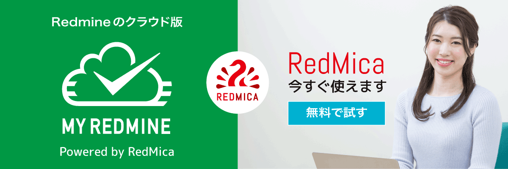

RedMicaとは
*************************

`RedMica <https://www.redmica.jp/>`_ はプロジェクト管理・課題管理のためのオープンソースソフトウェアです。広く普及しているオープンソースソフトウェア `Redmine <https://redmine.jp/>`_ がベースであり、Redmineに対して上位互換です。

RedMicaの最大の特長は、Redmineの次期バージョンの新機能を先行して使えることです。Redmineより短い6ヶ月間隔でRedmineの最新のソースコードをもとにリリースされるため、Redmineの次期バージョンに向けて開発が完了している機能をいち早く利用できます。

RedMicaはRedmineのソースコードをもとにファーエンドテクノロジー株式会社が独自にリリースを行っています。同社が提供するRedmineのクラウドサービス `My Redmine <https://hosting.redmine.jp/>`_ のサービス提供用として開発され、2019年11月に公開されました。

