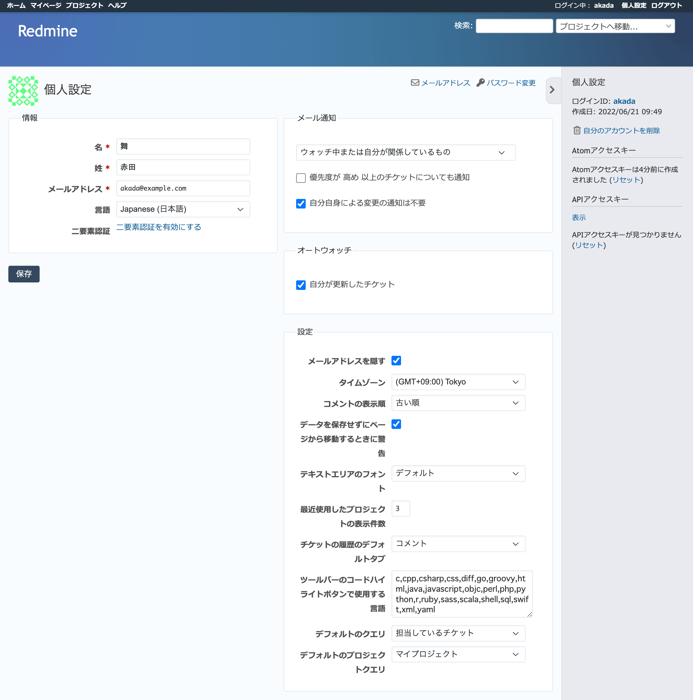

個人設定
--------

ログイン中のユーザーの氏名、メールアドレス、言語、メール通知の対象、パスワードなどの変更などが行えます。

   :guilabel:`個人設定` 画面

メールアドレス
  個人設定画面右上の :guilabel:`メールアドレス` をクリックすると、自分のアカウントの追加メールアドレスの追加や削除が行えます。

  追加メールアドレスは自分のアカウントに複数のメールアドレスを設定できる機能です。チケットの更新などRedMicaからのメール通知を複数のアドレスで受け取ることができます。

パスワード変更
  個人設定画面右上の :guilabel:`パスワード変更` をクリックすると、自分のパスワードを変更するための画面が表示されます。

情報
  氏名、メールアドレス、言語、二要素認証の設定を変更します。

  .. list-table:: 個人設定「情報」の入力項目
   :header-rows: 1

   * - 名称
     - 説明

   * - 名
     - ユーザーの名を入力します。

   * - 姓
     - ユーザーの姓を入力します。

   * - メールアドレス
     - ユーザーのメールアドレスを入力します。このメールアドレス宛にチケットの追加・更新などの通知が送信されます。

   * - 言語
     - RedMicaの画面表示で使われる言語を指定します。各々のユーザーが任意の言語を指定できます。 :dfn:`(auto)` を選択すると使用しているWebブラウザの言語設定にあわせて自動的に選択されます。

   * - 二要素認証
     - 二要素認証の有効化・無効化ができます。有効の場合はバックアップコードの生成が行えます。

メール通知
  RedMicaからどの範囲のメール通知を受けるか設定できます。デフォルトでは :dfn:`ウォッチ中または関係しているもの` です。プロジェクト全体の動きを把握したいときやRedMicaから送信されるメールの量を減らしたいときなどに設定を変更します。

  .. list-table:: 個人設定「メール通知」の選択肢
   :header-rows: 1

   * - 選択肢
     - 説明

   * - 参加しているプロジェクトのすべての通知
     - 参加している全プロジェクトについて、チケットの追加や更新、ニュースの追加などの通知がメールで送信されます。

   * - 選択したプロジェクトのすべての通知...
     - 選択したプロジェクトのみについて、チケットの追加や更新、ニュースの追加などの通知がメールで送信されます。ただし、選択していないプロジェクトでも、「ウォッチ中または関係しているもの」に該当する通知は送信されます。

   * - ウォッチ中または関係しているもの
     - デフォルト設定です。以下の事柄が通知されます。

       * 自分が追加したチケットが更新された
       * 自分が担当するチケットが更新された
       * チケットの更新により自分が担当者に設定された
       * 自分がウォッチしているチケットが更新された

   * - ウォッチ中または自分が担当しているもの
     - 「ウォッチ中または関係しているもの」から自分が追加したチケットの更新の通知を除いたもので、以下の事柄が通知されます。

       * 自分が担当するチケットが更新された
       * チケットの更新により自分が担当者に設定された
       * 自分がウォッチしているチケットが更新された

   * - ウォッチ中または自分が作成したもの
     - 以下の事柄が通知されます

       * 自分が追加したチケットが更新された
       * 自分がウォッチしているチケットが更新された

   * - 通知しない
     - メール通知を行わないようにします。

  .. note::

     ニュースに関する通知は、メール通知の設定内容とは無関係に常に通知されます。

  .. list-table:: 個人設定「メール通知」のその他の設定項目
   :header-rows: 1

   * - 名称
     - 説明

   * - 優先度が 高め 以上のチケットについても通知
     - ONにすると、通知対象外のチケット更新であっても、優先度が高く設定されていれば通知がメールで送信されます。

   * - 自分自身による変更の通知は不要
     - ONにすると、自分がRedMicaを操作したことにより発生した通知についてはメールを送りません。例えば、自分がチケットを追加したり更新したりしたことの通知は自分宛にはメール送信されません。

オートウォッチ
	自動的にウォッチするか設定を行います。

  .. list-table:: 個人設定「オートウォッチ」の設定項目
   :header-rows: 1

   * - 選択肢
     - 説明

   * - 自分が更新したチケット
     - ONにすると、自分が更新したチケットは自動的にウォッチします。

設定
	アカウントに関するその他の設定を行います。

  .. list-table:: 個人設定「設定」の設定項目
   :header-rows: 1

   * - 名称
     - 説明

   * - メールアドレスを隠す
     - ONにすると、アカウント表示画面でメールアドレスの表示を行いません。

       RedMicaをインターネットに公開した状態で使用する際にスパム送信業者などにアドレスが収集されるのを防ぎたいときや、他のユーザーにメールアドレスを知られたくないときに使用します。

   * - タイムゾーン
     - どのタイムゾーンで時刻を表示するのか設定します。RedMicaの画面上の時刻表示は設定されたタイムゾーンにあわせて変更されます。各々のユーザー毎に任意のタイムゾーンを指定できます。

   * - コメントの表示順
     - チケットに対する注記の表示順です。デフォルトでは古い順に上から表示しますが、「新しい順」に設定すると順序が逆になり、最新の注記が常に一番上に表示されるようになります。

       ブラウザの画面をスクロールせずに最新の注記を確認できるようにしたい場合などに便利です。

   * - データを保存せずにページから移動するときに警告
     - チケットの更新など画面で入力を行っている途中にリンクのクリックやブラウザの戻るボタンで別画面に遷移しようとしたときに警告を表示します。デフォルトではONです。

   * - テキストエリアのフォント
     - 入力欄の表示に等幅フォントとプロポーショナルフォントのどちらを使うのか選択できます。

   * - 最近使用したプロジェクトの表示件数
     - プロジェクトセレクタの「最近使用したもの」に表示される最近アクセスしたプロジェクトの数を設定します。

   * - チケットの履歴のデフォルトタブ
     - チケットの履歴に表示するデフォルトのタブを設定します。

   * - ツールバーのコードハイライトボタンで使用する言語
     - RedMicaのツールバーのコードハイライトボタンで表示する言語を設定します。自分がよく使う言語だけを表示しておけば入力が簡単になります。

   * - デフォルトのクエリ
     - チケット一覧画面でデフォルトで表示するカスタムクエリを設定します。

   * - デフォルトのプロジェクトクエリ
     - プロジェクト一覧画面でデフォルトで表示するカスタムクエリを設定します。

Atomアクセスキー
	RedMicaのいくつかの情報はAtomフィードとして出力されています。フィードURLにはRSSリーダーから認証無しでアクセスできますが、他人がフィードを参照して情報が漏洩するのを防ぐためにユーザー固有の類推しにくいキーがURLに含まれています。このキーをAtomアクセスキーと呼びます。

	AtomアクセスキーをリセットするとAtomアクセスキーが新しく作り直されます。古いアクセスキーは無効となりフィールドURLも変わるため。フィードリーダーの設定のやり直しが必要となります。

APIアクセスキー
	他のアプリケーションからRedMica上の情報を操作するためのREST APIを利用する際にユーザー認証に使われるのがAPIアクセスキーです。この情報は :guilabel:`管理 --> 設定 --> API` 画面で :guilabel:`RESTによるWebサービスを有効にする` をONにしているときのみ表示されます。

	:guilabel:`表示` リンクをクリックすると現在のAPIアクセスキーが表示されます。REST APIを利用するアプリケーションに自分のAPIアクセスキーを設定するときに使用します。

	:guilabel:`リセット` リンクをクリックすると現在のAPIアクセスキーが破棄され新しいものが作成されます。セキュリティ確保のため定期的にAPIアクセスキーを変更したいときや他人にAPIアクセスキーが漏洩したときなどに使用します。
