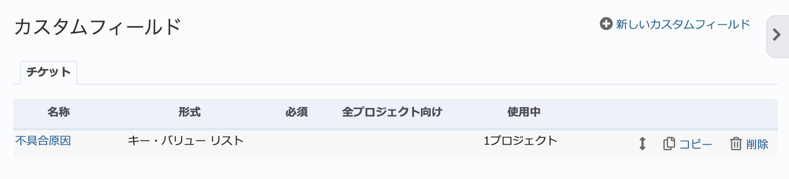

カスタムフィールド（管理 画面）
--------------------------------

カスタムフィールドを使うと、チケットに標準では用意されていない新たな入力項目を追加したり、作業時間、プロジェクト、ユーザーなどに対して独自の属性を持たせることができます。たとえば以下のような使い方ができます。

* RedMicaを顧客からの問い合わせを管理するために使用しているケースで、チケットに対して顧客コード、氏名、電話番号を格納するためのテキスト型カスタムフィールドを追加。
* ユーザーに対して、社員番号を格納するためのテキスト型カスタムフィールドを追加。

カスタムフィールドには以下のオブジェクトに対して作成できます。

.. list-table::
   :header-rows: 1

   * - 追加対象
     - 表示される箇所

   * - チケット
     - チケット、チケット一覧、カスタムクエリ、作業時間の記録

   * - 作業時間
     - 作業時間

   * - プロジェクト
     - プロジェクトの :guilabel:`概要` 画面

   * - バージョン
     - :guilabel:`ロードマップ` 画面、バージョンの詳細表示

   * - 文書
     - 文書

   * - ユーザー
     - ユーザーの詳細画面

   * - グループ
     - 「管理」→「グループ」→グループの作成・編集画面の「全般」タブ内

   * - 作業分類（時間管理）
     - プロジェクトの「設定」→「時間管理」画面、「管理」→「選択肢の値」→作業分類（時間管理）の作成・編集画面

   * - チケットの優先度
     - 「管理」→「選択肢の値」→チケットの優先度の作成・編集画面

   * - 文書カテゴリ
     - 「管理」→「選択肢の値」→文書カテゴリの作成・編集画面

カスタムフィールド一覧画面
**************************

管理画面で「カスタムフィールド」をクリックすると、カスタムフィールドの一覧画面が表示されます。登録されているカスタムフィールドの確認、新規作成、編集、削除、並び順の変更が行えます。

一覧画面はカスタムフィールドの種類毎にタブで分類されています。

    カスタムフィールド一覧画面

新しいカスタムフィールドの作成
******************************

画面右上の「新しいカスタムフィールドを作成」をクリックしてください。カスタムフィールドを追加するオブジェクトを選択する画面が表示されます。追加対象のオブジェクトを選択して :guilabel:`次へ` をクリックしてください。選択したオブジェクトに応じたカスタムフィールドの作成画面が表示されます。

.. figure:: ../images/custom_fields-new.png

    カスタムフィールドを作成するオブジェクトの選択

作成画面は選択したオブジェクトにより異なります。ここでは最も使用頻度が高いと思われるチケットのカスタムフィールドについて説明します。

.. figure:: ../images/custom_fields-new-issue.png

    「新しいカスタムフィールドを作成」画面(チケット)

.. list-table:: チケットのカスタムフィールド作成画面の入力項目
    :header-rows: 1

    * - 名称
      - 説明

    * - 書式
      - カスタムフィールドでどのような入力を受け付けるのかを指定します。

        **キー・バリュー リスト:**
        あらかじめ指定した値の中から一つを選択するドロップダウンリストボックスによる入力を受け付けます。選択肢の内容を変更した場合、既に作成済みのチケットにも変更内容を反映します。

        **テキスト:**
        1行のテキスト入力を受け付けます。

        **バージョン:**
        プロジェクトに作成されているバージョンの一覧から選択するドロップダウンリストボックスによる入力を受け付けます。

        **ファイル:**
        ファイルのアップロードを受け付けます。

        **ユーザー:**
        プロジェクトのメンバーの一覧から選択するドロップダウンリストボックスによる入力を受け付けます。

        **リスト:**
        あらかじめ指定した値の中から一つを選択するドロップダウンリストボックスによる入力を受け付けます。選択肢の内容を変更しても、既に作成済みのチケットに変更内容は反映されません。

        **リンク:**
        書式「テキスト」と同様に1行のテキスト入力を受け付けます。ただし、入力された値はURLとして扱われ、その値を表示する際には値にリンクが設定されます。

        **小数:**
        小数値の入力を受け付けます。

        **整数:**
        整数値の入力を受け付けます。

        **日付:**
        日付の入力を受け付けます。

        **真偽値:**
        チェックボックスのON/OFFの入力を受け付けます。

        **長いテキスト:**
        複数行のテキスト入力を受け付けます。

    * - 名称
      - カスタムフィールドの名称です。カスタムフィールドが画面に表示されるときに使われます。

    * - 説明
      - カスタムフィールドの説明をここに記述しておくと、この内容がカスタムフィールドの名称を表示する際にツールチップとして設定されます。チケットの作成・編集画面ででカスタムフィールドの名称にマウスカーソルを当てると説明の内容が表示されます。

    * - デフォルト値
      - カスタムフィールドのデフォルト値を設定することができます。

    * - 必須
      - ONにするとこのカスタムフィールドが必須入力の項目になります。値の入力を省略することができなくなります。

    * - フィルタとして使用
      - ONにすると :guilabel:`チケット` 画面のフィルタでカスタムフィールドの値による絞り込みが行えます。

    * - 検索対象
      - ONにすると このカスタムフィールドの値もRemdineの検索機能で検索できるようになります。

    * - 表示
      - このカスタムフィールドを利用できるロールを限定できます。例えば、管理者ロールのみ閲覧可能なカスタムフィールドを作成することができます。

    * - トラッカー
      - どのトラッカーのチケットでこのカスタムフィールドを使うのかを指定します。トラッカーの編集画面でも設定できます。

    * - プロジェクト
      - どのプロジェクトでこのカスタムフィールドを使うのかを指定します。 プロジェクトの :menuselection:`設定 --> 情報` 内の :guilabel:`カスタムフィールド` でも設定できます。
