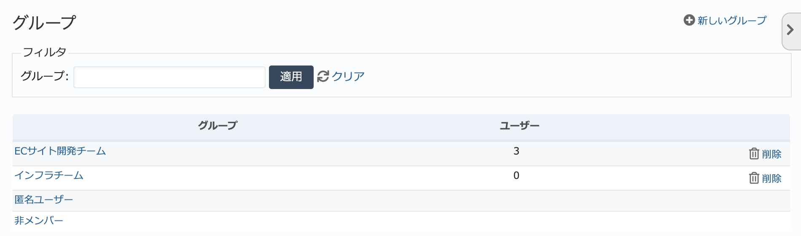
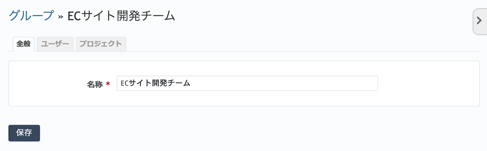
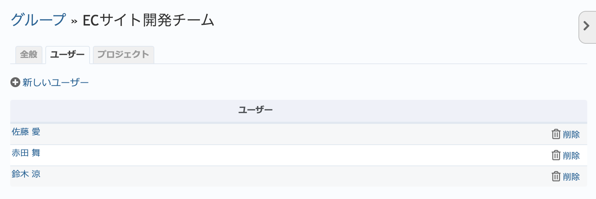
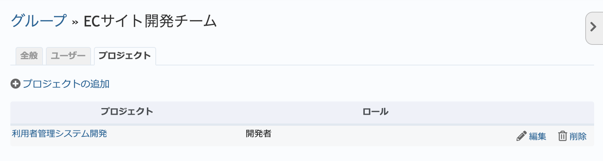

グループ（管理 画面）
----------------------

グループの作成、グループへのユーザーの追加などを行います。

グループとは複数のユーザーをまとめるためのものです。グループを利用することで、多数のユーザーをグループ単位でまとめてプロジェクトのメンバーとしたり、チケットの担当者をグループに割り当てたりできます。

グループを構成するユーザーを変更するとそのグループを参照しているプロジェクトのメンバーもあわせて変更されるので、特に多数のプロジェクトを利用している場合などに人事異動などへの対応が容易になります。

   グループ一覧画面

.. note:: :dfn:`匿名ユーザー` と :dfn:`非メンバー` はRedMicaの組み込みグループです。 :dfn:`匿名ユーザー` はログインしていないユーザーを、 :dfn:`非メンバー` はログインしているがメンバーには追加されていないユーザーを表します。公開プロジェクトにおいてこれらのグループをメンバーとすることで、非メンバーや匿名ユーザーがプロジェクトにアクセスするときにどのロールでアクセスさせるのか指定できます。

新しいグループの作成
********************

グループ一覧画面の右上の「新しいグループ」をクリックすると、新たなグループを作成するための画面が表示されます。

.. figure:: ../images/groups-new.png

グループの編集
**************

グループ一覧画面でグループ名をクリックすると、グループの名称の変更、グループへのユーザーの追加、グループをプロジェクトに参加させたりなどを行う画面に移動します。この画面には「全般」、「ユーザー」、「プロジェクト」の三つのタブがあります。

「全般」タブではグループの名称の変更が行えます。

    グループの編集画面(「全般」タブ)

「ユーザー」タブでは、グループを構成するユーザーの追加や削除が行えます。

    グループの編集画面(「ユーザー」タブ)

「プロジェクト」タブでは、グループが所属するプロジェクトの追加や削除、ロールの変更ができます。

    グループの編集画面(「プロジェクト」タブ)

グループの削除
**************

グループ一覧画面で「削除」をクリックするとグループが削除されます。一旦グループを削除すると元に戻すことはできません。
