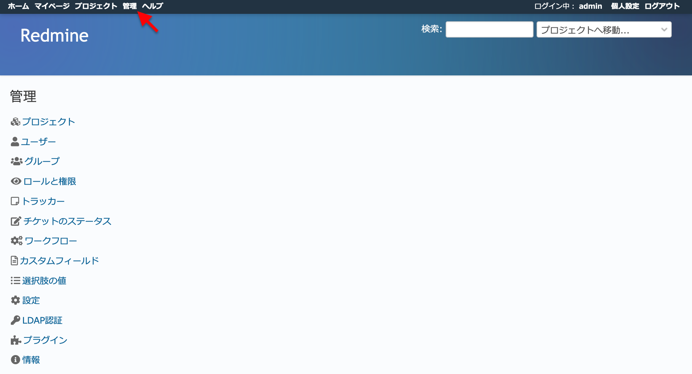

アプリケーション全体の設定
==========================

「管理」画面では、プロジェクトやユーザーを作成したり、全般的な設定をしたりといったRedMica全体に関わる管理を行います。

RedMicaのシステム管理者権限を持っているユーザー（デフォルトではadmin）のみがトップメニューの「管理」からアクセスできます。

   管理画面

.. toctree::
   :maxdepth: 1

   projects.rst
   users.rst
   groups.rst
   roles.rst
   trackers.rst
   issue_statuses.rst
   workflows-edit.rst
   workflows-permissions.rst
   custom_fields.rst
   enumerations.rst
   settings/index.rst
   auth_sources.rst
   plugins.rst
   info.rst
