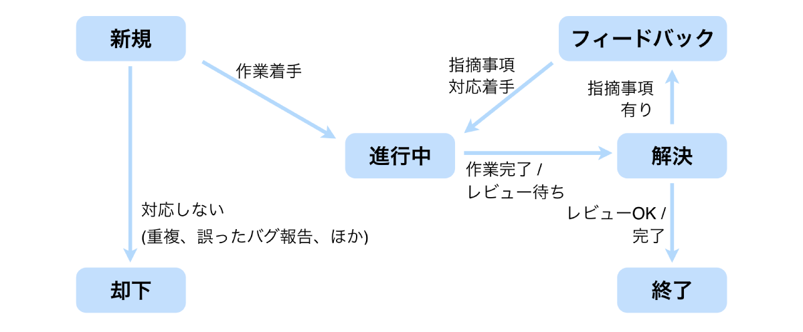
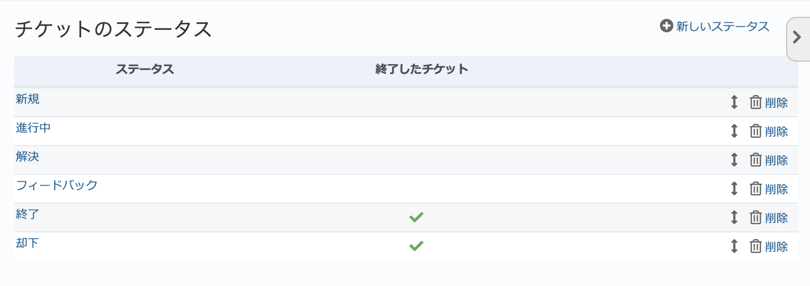
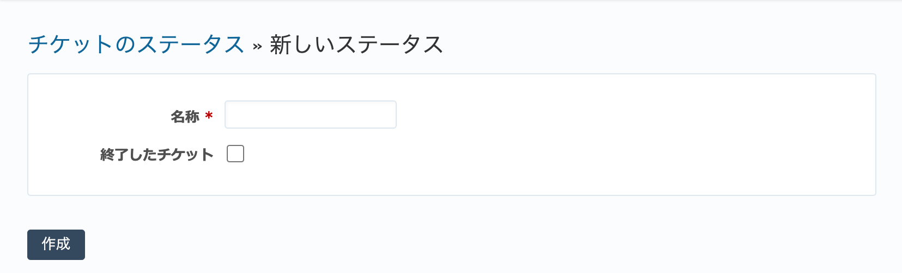

チケットのステータス（管理 画面）
----------------------------------

チケットには現在の状況を端的に表すための項目 :guilabel:`ステータス` があります。プロジェクトのメンバーは作業の進捗に応じてステータスを変更します。

デフォルトでは6個のステータスが定義されており、次の表のような意味を持っています。

.. list-table:: デフォルトのステータスと意味
   :header-rows: 1

   * - ステータス名
     - 説明

   * - 新規
     - チケットが新たに作成された状態。作業は未着手。

   * - 進行中
     - 担当者が作業に着手。

   * - 解決
     - 担当者の作業が終了。テスト／レビュー待ち。

   * - フィードバック
     - テストやレビューを行った結果、修正などが必要となり、担当者に差し戻したもの。

   * - 終了
     - 作業終了。

   * - 却下
     - 作業を行わずに終了。採用されなかった新機能の提案、修正する必要のないバグ（重複した報告、報告者の誤認による報告など）。

.. note::
   ステータス名の :dfn:`フィードバック` は意味を想像しにくいので、 :dfn:`差し戻し` 等に変更した方がわかりやすいかもしれません。

デフォルトで定義されているステータスの遷移の例を次の図に示します。

   典型的なステータスの遷移

ステータスはチームの業務フローにあわせて追加・変更できます。また、ワークフローの設定により、あるステータスからどのステータスに変更できるのか制限できます。たとえば、ステータス「新規」のチケットは「進行中」か「却下」のどちらかにしか変更できないよう制限したり、ステータス「解決」のチケットを「終了」にできるのを管理者ロールのメンバーに限定したりといった設定が可能です。

ステータス一覧画面
******************

管理画面で「チケットのステータス」をクリックするとステータス一覧画面に移動します。この画面ではステータスの新規作成、既存ステータスの編集、削除、並べ替えが行えます。

    ステータス一覧画面

新しいステータスの作成
**********************

ステータス一覧画面の右上の「新しいステータス」をクリックすると、新たなステータスを作成するための画面が表示されます。

    「新しいステータス」画面

.. list-table:: 「新しいステータス」画面の入力項目
    :header-rows: 1

    * - 名称
      - 説明

    * - 名称
      - ステータスの名称です。

    * - 終了したチケット
      - ONにすると、このステータスは作業が終了した状態を表すものとして扱われ、チケットの一覧を表示する画面で「完了」に分類されたり、 :guilabel:`ロードマップ` 画面で「完了」として集計されたりします。

        デフォルトでは :dfn:`終了` と :dfn:`却下` の二つのステータスが :dfn:`終了したチケット` に設定されています。

ステータスの編集
****************

	ステータス一覧画面でステータス名をクリックすると、ステータスの編集を行うための画面が表示されます。入力項目は「新しいステータス」画面とほぼ同じです。

.. warning::
   新たなステータスを追加したら :guilabel:`ワークフロー` 画面の :guilabel:`ステータスの遷移` タブで既存のステータスと新たなステータスと相互に遷移させる設定を行ってください。単にステータスを追加しただけでは利用できません。
