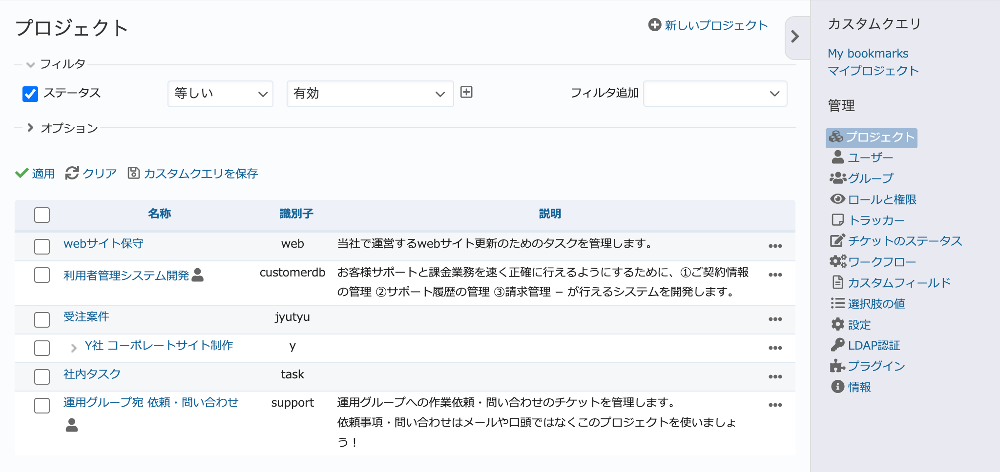

プロジェクト（管理 画面）
--------------------------

新しいプロジェクトの作成や、既存プロジェクトの設定変更・削除などを行います。

プロジェクトの一覧
******************

:guilabel:`管理` 画面で「プロジェクト」をクリックするとプロジェクトの一覧が表示されます。

    プロジェクト一覧画面

表示されるプロジェクトの一覧は「フィルタ」により絞り込まれていて、デフォルトでは :dfn:`有効` が適用されています。フィルタの動作は次の表の通りです。

.. list-table:: プロジェクト一覧画面のフィルタの動作
    :header-rows: 1

    * - ステータス
      - 説明

    * - すべて
      - すべてのプロジェクトが表示されます。

    * - 有効
      - 現在利用可能なプロジェクト（ステータスが「終了」または「アーカイブ」でないもの）が表示されます。プロジェクト一覧画面を開いた直後は「有効」が選択されています。

    * - 終了
      - :dfn:`終了` 状態のプロジェクトが表示されます。この状態のプロジェクトは、情報の参照はできますが更新を行うことはできません。

    * - アーカイブ
      - :dfn:`アーカイブ` 状態のプロジェクトが表示されます。この状態のプロジェクトは、プロジェクトセレクタ等にも表示されず情報の参照・更新を行うこともできません。

.. note::
    プロジェクトを「終了」状態にするには、 :dfn:`プロジェクトの終了/再開` 権限を持つユーザーでログインしてプロジェクトの :guilabel:`概要` 画面右上の :guilabel:`…` → :guilabel:`終了` をクリックしてください。

新しいプロジェクトの作成
************************

画面右上の :guilabel:`新しいプロジェクト` をクリックすると、新たなプロジェクトを作成するための画面が表示されます。

:guilabel:`新しいプロジェクト` 画面ではプロジェクトの設定の一部のみが行えます。メンバーの追加、リポジトリの設定などはプロジェクトの編集画面で行ってください。

.. figure:: ../images/projects-new.png

    「新しいプロジェクト」画面

.. list-table:: 「新しいプロジェクト」画面の入力項目
  :header-rows: 1

  * - 名称
    - 説明

  * - 名称
    - プロジェクトの名称です。プロジェクトセレクタなどの表示に使われます。

  * - 説明
    - プロジェクトについての簡単な説明です。プロジェクトの :guilabel:`概要` 画面などで表示されます。

  * - 識別子
    - 全てのプロジェクトの中で一意なプロジェクト識別子です。URLの一部などに使われます。プロジェクト作成後は識別子を変更することはできません。

  * - ホームページ
    - プロジェクトに関連するWebサイトのURLを入力します。 :guilabel:`概要` 画面で表示されます。

  * - 公開
    - チェックボックスをONにすると公開プロジェクトになります。公開プロジェクトは、プロジェクトのメンバーではないユーザーも情報を閲覧できます。また、 :menuselection:`管理 --> 設定 --> 認証` で :guilabel:`認証が必要` を「いいえ」にしている場合はログイン無しで誰でもプロジェクトの情報を閲覧できます。

      この項目のデフォルト値はONですが、 :menuselection:`管理 --> 設定 --> プロジェクト` 画面で :guilabel:`デフォルトで新しいプロジェクトは公開にする` をOFFにすることで、デフォルト値をOFFにすることができます。

  * - 親プロジェクト名
    - プロジェクトをあるプロジェクトの子プロジェクトとして作成するとき、どのプロジェクトを親とするのか選択します。

  * - メンバーを継承
    - メンバーを継承すると親プロジェクトのメンバーが親プロジェクトにおけるロールでこのプロジェクトにもアクセスできます。

  * - モジュール
    - プロジェクトで使用する機能を選択します。当面利用する予定が無い機能は利用者の混乱を防ぐためOFFにしておくことをおすすめします。

プロジェクトの編集
******************

プロジェクト一覧画面でプロジェクト名をクリックすると、プロジェクトの名前の変更や設定変更が行える編集画面が表示されます。プロジェクトメニューから「設定」を選んだときと同じ画面です。ここでは「新しいプロジェクト」画面では行えない、プロジェクトに関する全ての設定が行えます。

プロジェクトのアーカイブ
************************

プロジェクト一覧画面で「アーカイブ」をクリックすると、全ユーザーからそのプロジェクトが見えなくなります。もう使わないプロジェクトだが一応残しておきたい場合などに使用します。

アーカイブしたプロジェクトを元の状態に戻すには、プロジェクト一覧画面の :guilabel:`フィルタ` 内の :guilabel:`ステータス` で :dfn:`アーカイブ` を選択してアーカイブ状態のプロジェクトを表示させてから :guilabel:`アーカイブ解除` をクリックします。

    プロジェクトのアーカイブ解除

.. note::
    アーカイブと似たような機能にプロジェクトの「終了」がありますが、プロジェクトを非表示にするのではなく、参照可能な状態で読み取り専用にする点が異なります。

プロジェクトのコピー
********************

プロジェクト一覧画面で「コピー」をクリックすると、既存のプロジェクトを雛形として新しいプロジェクトを作成することができます。新規のプロジェクトを作成する際に、必ず必要となる定型的なチケットやバージョンをあらかじめ作成した雛形プロジェクトをコピーするようにすれば、プロジェクト立ち上げ時の作業を省力化できます。

プロジェクトの削除
********************

	プロジェクト一覧画面で「削除」をクリックするとプロジェクトのすべてのデータが完全に削除されます。一旦プロジェクトを削除すると元に戻すことはできません。
