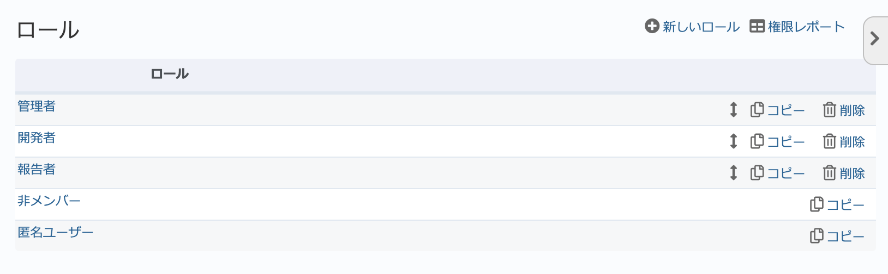
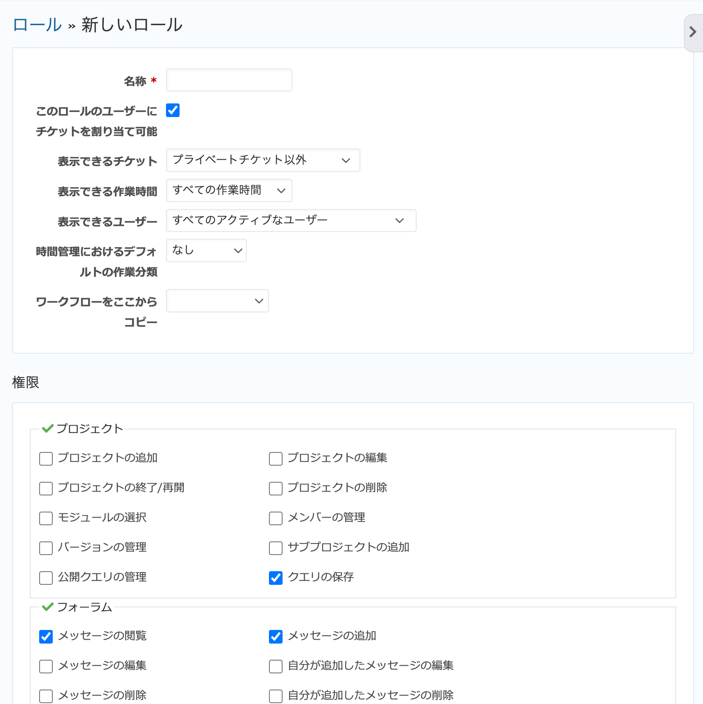
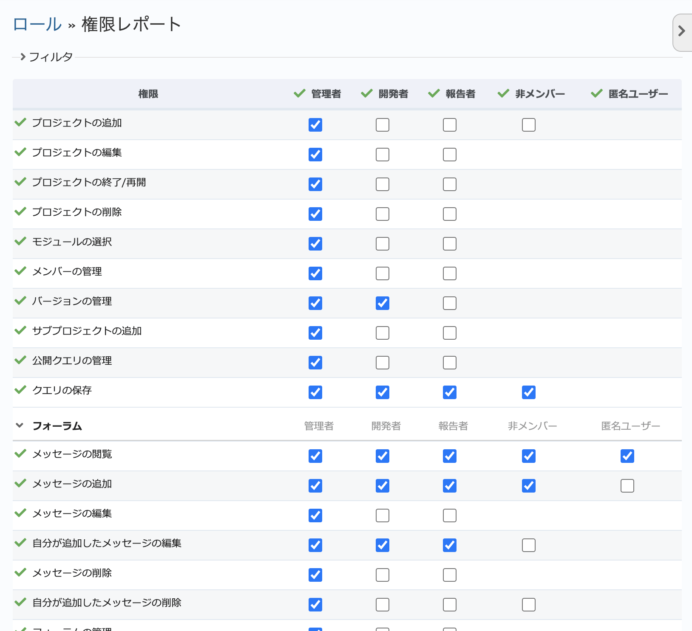

ロールと権限（管理 画面）
--------------------------

新しいロールの作成や、既存ロールの設定変更・割り当て権限変更、削除を行います。

ロール(roll)とはそのまま訳すと役割という意味で、RedMicaにおいてはメンバーがプロジェクトでどのような操作が可能か定義するものです。一つのロールではRedMica上の数十個の権限の有無がまとめて定義されています。

ユーザーをプロジェクトのメンバーとするときには、必ず一つ以上のロールを指定します。

デフォルトでは以下のロールが定義されています。

.. list-table:: 初期状態で定義されているロール
   :header-rows: 1

   * - 名称
     - 種別
     - 説明

   * - 管理者
     - ユーザー定義
     - すべての権限が割り当てられています。

   * - 開発者
     - ユーザー定義
     - プロジェクトの管理機能以外の多くの権限が割り当てられています。

   * - 報告者
     - ユーザー定義
     - テスター向けのロール。チケットの作成・注記の追加や情報の閲覧に限られています。

   * - 非メンバー
     - システムロール
     - ログイン中のユーザーが、自分がメンバーとなっていない公開プロジェクトにアクセスする際に適用されるロール。

   * - 匿名ユーザー
     - システムロール
     - ログインしていないユーザーが公開プロジェクトにアクセスする際に適用されるロール。 :menuselection:`管理 --> 設定 --> 認証` で :guilabel:`認証が必要` が「いいえ」の場合、ログインしていないユーザーも公開プロジェクトにはアクセスできます。

.. note:: システムロールの削除や名称の変更はできません。

ロール一覧画面
****************

管理画面で「ロールと権限」をクリックするとロール一覧画面が表示されます。この画面ではロールの新規作成、既存ロールの編集、削除、並べ替えが行えます。

    ロール一覧画面

新しいロールの作成
******************

ロール一覧画面の右上の「新しいロール」をクリックすると、新たなロールを作成するための画面が表示されます。ロールを作成するにはこの画面で必要な項目を入力し「作成」をクリックしてください。

  「新しいロール」画面

.. list-table:: 「新しいロール」画面の入力項目
    :header-rows: 1

    * - 名称
      - 説明

    * - 名称
      - ロールの名称です。

    * - このロールにチケットを割り当て可能
      - OFFにすると、このロールのメンバーはチケットの担当者にできなくなります。

    * - 表示できるチケット
      - プロジェクト内で閲覧できるチケットの範囲を設定します。

        * **すべてのチケット**: 他のユーザーが作成したプライベートチケットを含め、プロジェクト内のすべてのチケットを閲覧できます。 :dfn:`管理者` ロールはこの設定です。

        * **プライベートチケット以外**: 他のユーザーが作成したプライベートチケットは閲覧できませんが、それ以外のプロジェクト内のすべてのチケットを閲覧できます。デフォルトはこの設定です。

        * **作成者か担当者であるチケット**: 自分が作成したか、自分が担当者であるチケットしか表示されません。閲覧できるチケットが極めて限定された状態です。

    * - 表示できる作業時間
      - プロジェクト内で閲覧できる作業時間の範囲を設定します。

        * **すべての作業時間**: プロジェクト内のすべての作業時間を閲覧できます。デフォルトはこの設定です。

        * **自分の作業時間**: 自分が入力した作業時間のみ閲覧できます。

    * - 表示できるユーザー
      - プロジェクト内で閲覧できるユーザーの範囲を設定します。

        * **すべてのアクティブなユーザー**: RedMicaのすべてのユーザーを閲覧できます。デフォルトはこの設定です。

        * **見ることができるプロジェクトのメンバー**: プロジェクトのユーザーのみ閲覧できます。

    * - 時間管理におけるデフォルトの作業分類
      - このロールの時間管理の作業分類のデフォルト値を設定します。「なし」にすると RedMica全体のデフォルト値（ :doc:`../admin/enumerations` の :dfn:`作業分類 (時間管理)` ） が表示され、RedMica全体でデフォルトを設定していない場合は未選択となります。

    * - ワークフローをここからコピー
      - ワークフローとはプロジェクトのメンバーがチケットのステータスをどのように変更できるか定義したもので、ロールとトラッカーの組み合わせ毎に定義されています。「ワークフローをここからコピー」でコピー元のロールを選択すると、コピー元と同じ内容のワークフローが新しいロールに対して作成されます。

        トラッカーやステータスが多いとワークフローの定義にはかなり手間がかかります。ロールを作成するときに既存のロールからワークフローをコピーした上で必要な変更を加えるようにすれば必要な労力を減らせます。

    * - 権限
      - このロールにどの権限を割り当てるのかチェックボックスをONにして選択します。

    * - チケットトラッキング
      - トラッカーごとにチケットの操作のどの権限を割り当てるのかチェックボックスをONにして選択します。

ロールの編集
************

ロール一覧画面でロール名をクリックするとロールの名前の変更や権限割当を行う画面が表示されます。

.. note:: ロールに対する権限の割当は後述の「権限レポート」でも行えます。権限レポートでは複数のロールに対して一括で権限の変更ができます。

ロールの削除
ロール一覧画面で「削除」をクリックするとロールが削除されます。一旦ロールを削除すると元に戻すことはできません。

権限レポートの表示
******************

ロール一覧画面の右上にある「権限レポート」リンクをクリックすると、すべての権限とすべてのロールの組み合わせを示す表「権限レポート」が表示されます。この画面で権限の変更も行うことができます。

他のロールでの権限の割り当て状況も参照しながら権限の変更ができて便利です。

    権限レポート
