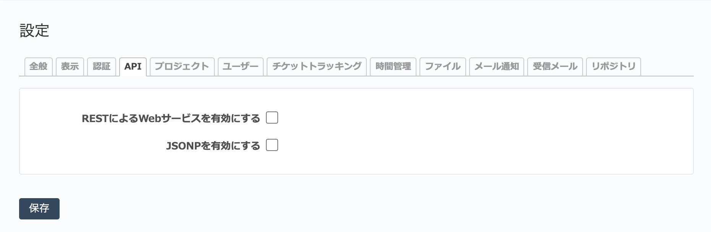

API タブ（管理→設定 画面）
-------------------------------

APIに関する設定を行います。

   「API」タブ

.. list-table:: APIタブの入力項目
   :header-rows: 1

   * - 名称
     - 説明

   * - RESTによるWebサービスを有効にする
     - REST APIを有効にします。REST APIにより、外部のアプリケーションからRemdineのプロジェクトおよびチケットの作成・読み取り・更新・削除が行えるようになります。REST API経由でRedMicaと連携するアプリケーションを使用したり開発したりする場合はこの項目を有効にしてください。

   * - JSONPを有効にする
     - REST APIをJSON利用で利用しているとき、クロスドメインでの通信を実現するためのJSONPを有効にします。

       JSONPでのレスポンスを得るには以下のようにパラメータ :kbd:`callback` でコールバック関数名を指定してください。

       ::

         GET /issues.json?callback=foo
         => foo({"issues":...})
