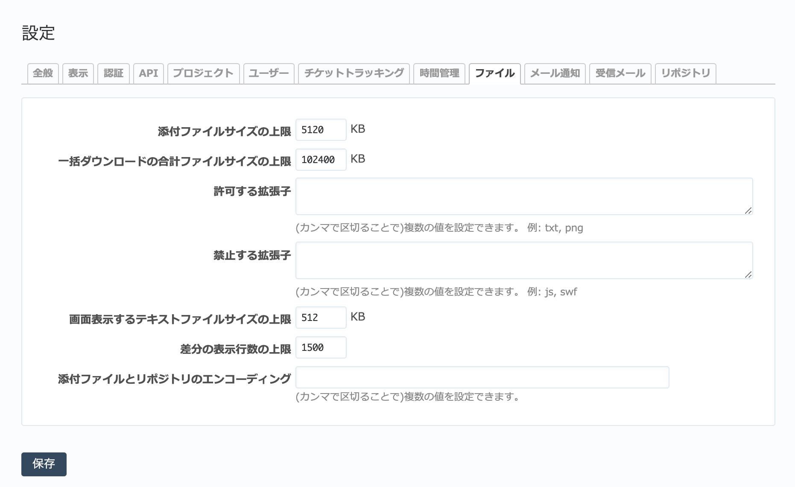

ファイル タブ（管理→設定 画面）
------------------------------------

ファイルに関する全般的な設定を行います。

  「ファイル」タブ

.. list-table:: 「設定」→「ファイル」の入力項目
  :header-rows: 1

  * - 名称
    - 説明

  * - 添付ファイルサイズの上限
    - チケットやWikiページにファイルを添付する際のファイルサイズの上限です。

  * - 一括ダウンロードの合計ファイルサイズの上限
    - チケットなどに添付しているファイルを一括ダウンロードする場合の合計ファイルサイズの上限です。

  * - 許可する拡張子
    - 添付したいファイルの拡張子を入力します。入力した拡張子のファイル以外は添付できません。

  * - 禁止する拡張子
    - 添付させたくないファイルの拡張子を入力します。入力した拡張子のファイル以外を添付することができます。

  * - 画面表示するテキストファイルサイズの上限
    - これより大きな添付ファイルはRedMicaの画面内で内容を表示しません。

  * - 差分の表示行数の上限
    - リポジトリ画面等でファイルの差分を表示する際の行数の上限です。

  * - 添付ファイルとリポジトリのエンコーディング
    - リポジトリのソースコードやテキスト形式の添付ファイルの文字エンコーディングを指定します。カンマで区切って複数のエンコーディングを指定すると、指定されたエンコーディングからの自動変換が行われます。

      日本語を扱うときは文字化けを回避するために必ず設定してください（設定例: :kbd:`UTF-8,CP932,EUC-JP`)。
