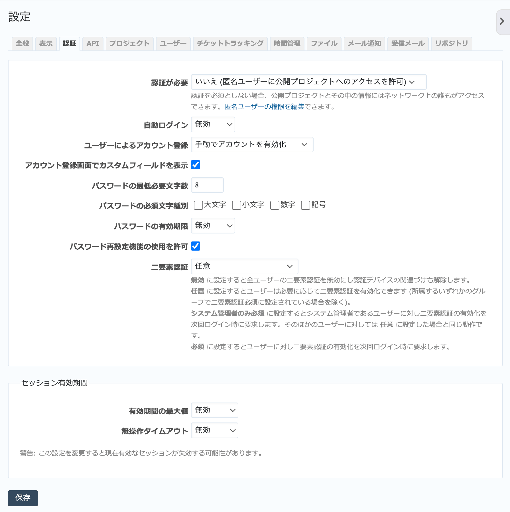

認証 タブ（管理→設定 画面）
--------------------------------

認証に関係する設定を行います。

   「認証」タブ

.. list-table:: 認証タブの入力項目
   :header-rows: 1

   * - 名称
     - 説明

   * - 認証が必要
     - 「はい」にすると、RedMica上の情報にアクセスするためには必ず認証が必要となります。「いいえ」の場合、未認証ユーザーでもホーム画面が表示されます。公開プロジェクトに対しては匿名ユーザーロールでアクセス可能です。

   * - 自動ログイン
     - デフォルトは「無効」ですが、「1日」「7日」「30日」「365日」などを選ぶと、その期間はブラウザを閉じてもログインしたままの状態となります（セッションが維持されます）。

   * - ユーザによるアカウント登録
     - 利用者自身の操作によるユーザー登録の可否を設定します。「無効」以外に設定するとRedMicaの画面右上に登録申請を行うための「登録する」リンクが表示されます。

       **無効:**
       利用者自身によるユーザー登録は行えません。

       **メールでアカウントを有効化:**
       利用者が登録操作を行った後、申告されたメールアドレス宛にアカウントを有効にするためのURLの記載されたメールが送信されます。

       **手動でアカウントを有効化:**
       利用者が登録操作を行うと管理者による承認待ち状態となり、RedMicaの管理者権限をもつ全ユーザーに承認待ちのユーザーがいる旨のメールが送信されます。管理者は :menuselection:`管理 --> ユーザー` でそのユーザーを有効にします。

       **自動でアカウントを有効化:**
       利用者が登録操作を行うと即RedMicaにアクセスできるようになります。

   * - アカウント登録画面でカスタムフィールドを表示
     - ユーザーの登録画面でカスタムフィールドを表示するかどうかを設定します。

   * - パスワードの最低必要文字数
     - パスワードの最低限の文字数を設定します。ここで設定した値より短いパスワードを設定することはできません。

   * - パスワードの必須文字種別
     - パスワードに指定した種類の文字が含むことを強制できます。ここで設定した種類の文字がないパスワードを設定することはできません。

   * - パスワードの有効期限
     - パスワードの定期変更をユーザーに強制することができます。無効、7日、30日、60日、90日、180日、365日の選択肢があります。

   * - パスワード再設定機能の使用を許可
     - 利用者によるパスワードの再発行機能が有効になります。ログイン画面に「パスワードの再発行」リンクが表示されるようになり、再発行を要求すると登録メールアドレス宛に新しいパスワードの設定が行えるURLが送信されます。

   * - 二要素認証
     - 二要素認証をユーザーが使用するかどうか無効、任意、システム管理者のみ必須、必須から設定します。

   * - 有効期間の最大値
     - セッションが有効な期間を指定します。

   * - 無操作タイムアウト
     - 一定期間操作が行われなかったときに自動的にセッションを無効にする設定を行います。
