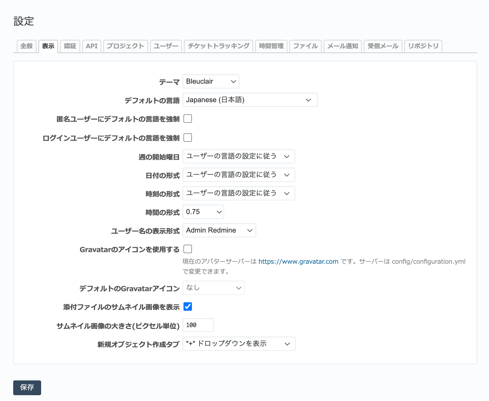
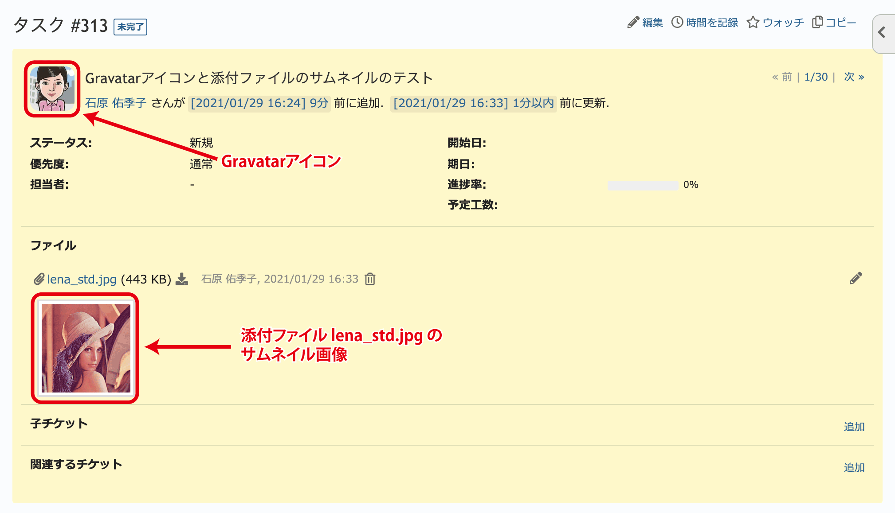

表示 タブ（管理→設定 画面）
--------------------------------

RedMicaのユーザーインターフェイスに関する設定を行います。

   「表示」タブ

.. list-table:: 表示タブの入力項目
   :header-rows: 1

   * - 名称
     - 説明

   * - テーマ
     - 画面の配色・フォントなどを定義したテーマを切り替えることができます。あらかじめ組み込まれている「デフォルト」「Alternate」「Classic」のほか、独自のテーマを作成することもできます。

   * - デフォルトの言語
     - 新しいユーザーを作成した際の初期設定値とする言語を選択します。

   * - 匿名ユーザーにデフォルトの言語を強制
     - ログインしていないユーザーがアクセスしてきたとき、ブラウザの言語設定を無視して常に :guilabel:`デフォルトの言語` で設定された言語で表示します。

   * - ログインユーザーにデフォルトの言語を強制
     - ユーザーの :guilabel:`個人設定` で設定されている言語を無視して常に :guilabel:`デフォルトの言語` で設定された言語で表示します。

   * - 週の開始曜日
     - カレンダーを表示する際に何曜日を開始とするか選択します。デフォルトは「ユーザの言語の設定に従う」で、ユーザーが :dfn:`個人設定` で :dfn:`日本語` を選択している場合は日曜日始まりになります。

   * - 日付の形式
     - 日付の書式を選択します。デフォルトは「ユーザの言語の設定に従う」で、ユーザーが :dfn:`個人設定` で :dfn:`日本語` を選択している場合は :dfn:`YYYY/MM/DD` 形式です。

   * - 時刻の形式
     - 時刻の書式を選択します。デフォルトは「ユーザの言語の設定に従う」で、ユーザーが :dfn:`個人設定` で :dfn:`日本語` を選択している場合は :dfn:`99:99` 形式(24時間表示)です。

   * - 時間の形式
     - 時間（予定工数、作業時間など）を小数、"HH:MM"のどちらの形式で表示するか選択できます。

   * - ユーザー名の表示書式
     - 姓と名をどのように表示するのか選択します。デフォルトは欧米式の「名 姓」ですが、「姓」、「名」、「姓 名」、「姓,名」という形式も選択できます。

   * - Gravatarのアイコンを使用する
     - Gravatar とは、ユーザーが登録しているアイコンを様々なwebサイトで利用するためのwebサービスです。この機能を有効にすると、チケットの画面や活動画面などにユーザー名とともにユーザーがGravatarに登録しているアイコンが表示されます。チケットの作成者・更新者を視覚的に識別できて便利です。

   * - デフォルトのGravatarアイコン
     - :guilabel:`Gravatarのアイコンを使用する` がONのとき、Gravatarにアイコンを登録していないユーザーに表示するアイコンを選択します。

   * - 添付ファイルのサムネイル画像を表示
     - チケットなどに画像ファイルが添付されている場合、サムネイル画像を表示させることができます。

   * - サムネイル画像の大きさ(ピクセル単位)
     - :guilabel:`添付ファイルのサムネイル画像を表示` がONのとき、表示するサムネイル画像の大きさを指定します。

   * - 新規オブジェクト作成タブ
     - チケットやWikiページなど新しいオブジェクトを作成する"＋"ボタンを表示するか、「新しいチケット」タブを表示するか、どちらも表示しないかを選択できます。

   Gravatarアイコンと添付ファイルのサムネイル画像の例
