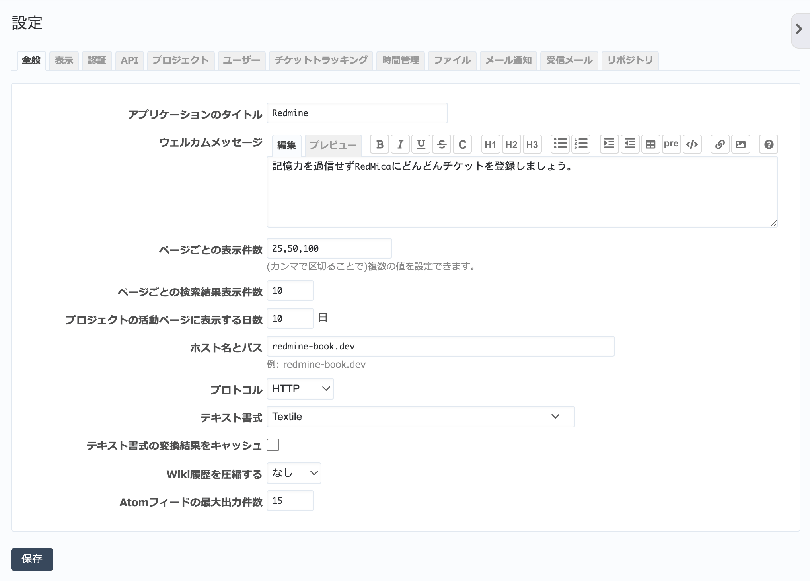

全般 タブ（管理→設定 画面）
--------------------------------

RedMicaのシステム全般に関する設定を行います。

   全般タブ

.. list-table:: 全般タブの入力項目
   :header-rows: 1

   * - 名称
     - 説明

   * - アプリケーションのタイトル
     - ログイン画面や :guilabel:`ホーム` ・ :guilabel:`マイページ` ・ :guilabel:`プロジェクト` などの画面のヘッダ部分に表示されるタイトルです。デフォルトは「Redmine」です。

   * - ウェルカムメッセージ
     - ホーム画面の左側に表示されるウェルカムメッセージの内容を設定します。

   * - ページごとの表示件数
     - チケット一覧やリビジョン一覧など大量の表示を行う画面で1ページに表示する最大件数を設定します。カンマ区切りで複数の値を設定するとユーザーが最大件数を切り替えることができるようになります。例えば「50,100,200」と設定した場合、デフォルトは1ページあたり50件表示を行い、100件または200件表示に切り替えることもできます。

   * - ページごとの検索結果表示件数
     - 1ページに表示する検索結果の表示件数を設定します。

   * - プロジェクトの活動ページに表示される日数
     - :guilabel:`活動` 画面で1ページに何日分の情報を表示するか設定します。

   * - ホスト名とパス
     - RedMicaが動作しているサーバのホスト名を指定します。メール通知の本文中のリンクURLを生成するのに使われます。デフォルトのままではリンクが正しく生成されませんので必ず設定してください。

       テキストフィールドの下にRedMicaが推測した値が例として表示されています。ほとんどの場合、この値をそのまま転記すれば正しい設定を行うことができます。

   * - プロトコル
     - 「http」または「https」を選択します。ホスト名と同じく、メール通知でリンクURLを生成するのに使われます。

   * - テキストの書式
     - 「なし」、「Textile」、「Markdown」、「CommonMark Markdown (GitHub Flavored) - experimental」から選択します。デフォルトは「Textile」で、チケットの説明やWikiでTextile記法による修飾が可能です。

   * - テキスト書式の変換結果をキャッシュ
     - TextileやMarkdownなどのテキスト書式からHTMLへの変換はブラウザにページを送信するたびに行われます(例: チケットの説明、Wikiページなど)。この設定を有効にすると、変換済みのHTMLがキャッシュされるようになります。

   * - Wiki履歴を圧縮する
     - 「なし」または「gzip」を選択します。デフォルトは「なし」です。gzipを選択するとWikiの履歴がgzipで圧縮された状態でデータベースに格納されるためディスク領域が節約できます。

   * - Atomフィードの最大出力件数
     - RSSフィードで出力する項目数の上限です。デフォルト値は15です。RSSリーダーは定期的にRedMicaのフィードを取得しますが、定期取得の間にここで設定された以上の件数の情報が発生するとRSSリーダー上で情報が欠落して見えることがあります。チケットの更新等が多い環境では値を大きくすることを検討してください。
