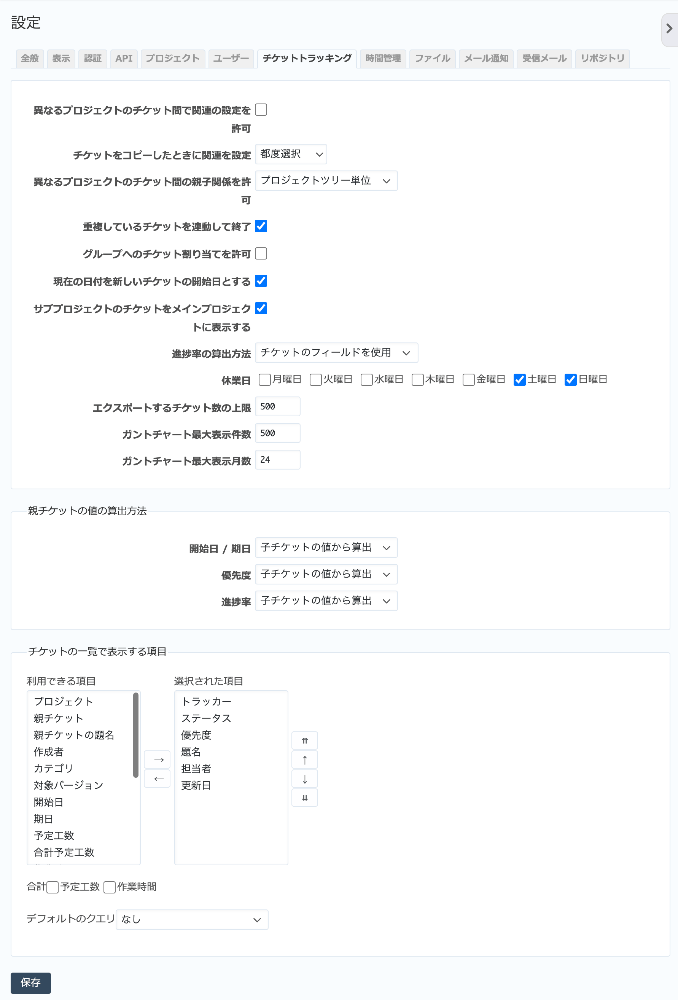

チケットトラッキング タブ（管理→設定 画面）
------------------------------------------------

チケット関係の機能に関する設定を行います。

   「チケットトラッキング」タブ

.. list-table:: チケットトラッキングタブの入力項目
   :header-rows: 1

   * - 名称
     - 説明

   * - 異なるプロジェクトのチケット間で関係の設定を許可
     - ONにすると、チケットの「関連するチケット」欄で他のプロジェクトのチケットを関連づけることができるようになります。デフォルト値はOFFです。

   * - チケットをコピーしたときに関連を設定
     - チケットをコピーしたとき、コピー元とコピー先のチケットに関連づけるかを設定します。

   * - 異なるプロジェクトのチケット間の親子関係を許可
     - 別のプロジェクトのチケットを親子関係にすることができるかどうかを設定します。

       * **無効**: 同一プロジェクトのチケット同士のみ親子関係にできます。
       * **すべてのプロジェクト**: どのプロジェクトのチケット同士でも親子関係にできます。
       * **プロジェクトツリー単位**: 最上位の親プロジェクトとそのすべての子孫プロジェクトのチケット間で許可します。
       * **プロジェクト階層単位**: 親プロジェクトなど上位階層のプロジェクトと子孫プロジェクトのチケット間で許可します。
       * **サブプロジェクト単位**: サブプロジェクトのチケットとの間で許可します。

   * - 重複しているチケットを連動して終了
     - 重複しているチケットを連動してステータスを終了にするか設定します。

   * - グループへのチケット割り当てを許可
     - 通常チケットの担当者には一人のユーザーを割り当てますが、この設定をONにするとプロジェクトのメンバーとなっているグループを担当者として割り当てることもできます。グループにチケットを割り当てると、そのグループに所属しているメンバーには自分が担当しているチケットのように見えます。

   * - 現在の日付を新しいチケットの開始日とする
     - 新しいチケットを作成する際、チケットの :guilabel:`開始日` はデフォルトではチケット作成日が入りますが、この項目をOFFにするとデフォルトの開始日が入らないようにできます。

   * - サブプロジェクトのチケットをメインプロジェクトに表示する
     - ONの場合、サブプロジェクトのチケットをメインプロジェクトのチケット一覧でも表示します。デフォルト値はONです。

   * - 進捗率の算出方法
     - :dfn:`チケットのステータスに連動する` に設定すると、チケットの進捗率を手入力する代わりにステータスに連動して自動設定することができます。

   * - 休業日
     - 土曜日・日曜日など、業務を行わない曜日を設定します。休業日の設定は以下の箇所に影響します。

       * **ガントチャート:**: 休業日と設定された曜日が灰色で表示されます。
       * **後続するチケットの開始日・期日の再計算:**: 先行−後続の関係にあるチケットがあるとき、先行するチケットの期日を変更すると後続するチケットの開始日・期日も自動的に再計算されます。このとき、再計算後の開始日・期日が休業日だった場合、自動的に翌営業日にずらされます。

   * - エクスポートするチケット数の上限
     - CSVおよびPDF形式でチケットをエクスポートする際のチケット数の上限です。デフォルトは500件です。

   * - ガントチャート最大表示件数
     - ガントチャートに表示する項目数の上限です。

   * - ガントチャート最大表示月数
     - ガントチャートに表示する月数の上限です。

   * - 開始日 / 期日
     - 親チケットの開始日・期日を子チケットの値から算出するか、単独で指定するか設定します。

   * - 優先度
     - 親チケットの優先度を子チケットの値から算出するか、単独で指定するか設定します。

   * - 進捗率
     - 親チケットの進捗率を子チケットの値から算出するか、単独で指定するか設定します。

   * - チケットの一覧で表示する項目
     - チケット一覧画面でデフォルトで表示する項目を設定します。「合計」の「予定工数」や「作業時間」をONにすると、表示されているチケットに入力された予定工数や作業時間の合計値を表示します。
