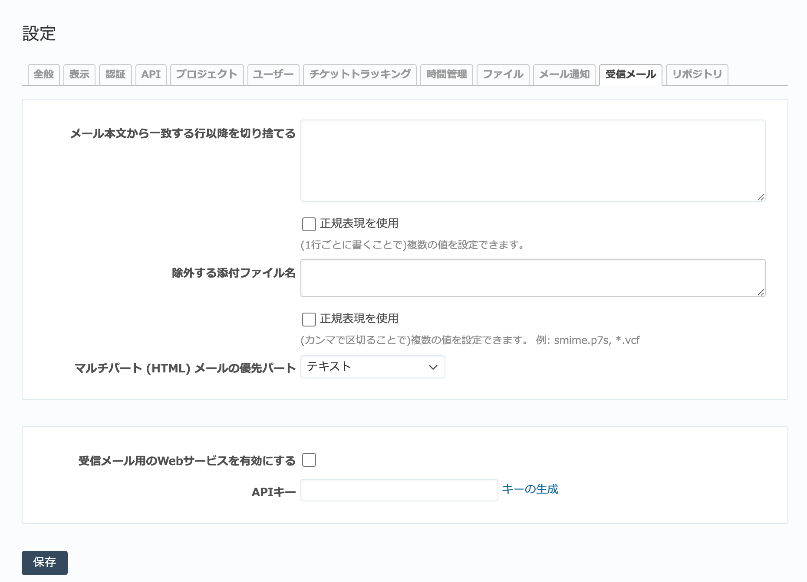

受信メール タブ（管理→設定 画面）
--------------------------------------

メールによるチケットの登録・更新に関する設定を行います。

.. warning::
   メールによるチケットの登録・更新を行うには、この画面での設定だけでなく、MTAまたはIMAPサーバと連携するための設定が必要です。

   「受信メール」タブ

.. list-table:: 「設定」→「受信メール」の入力項目
   :header-rows: 1

   * - 名称
     - 説明

   * - メール本文から一致する行以降を切り捨てる
     - メールのフッタなど不要な情報がRedMicaのチケットに登録されないよう、メール本文の特定の行以降の内容を無視するよう設定します。

   * - 除外する添付ファイル名
     - ファイル名が特定のパターンに一致する添付ファイルはチケットの添付ファイルとして登録せずに無視します。

       電子署名ファイル(:file:`smime.p7s`) などを指定して、余計なファイルがチケットに登録されるのを防ぎます。

   * - マルチパート (HTML) メールの優先パート
     - テキスト、HTMLから設定します。

   * - 受信メール用のWebサービスを有効にする
     - メールによるチケットの登録・更新を有効にします。

   * - APIキー
     - メールによるチケットの登録・更新のための設定を行う際の連携用APIキーを設定します。
