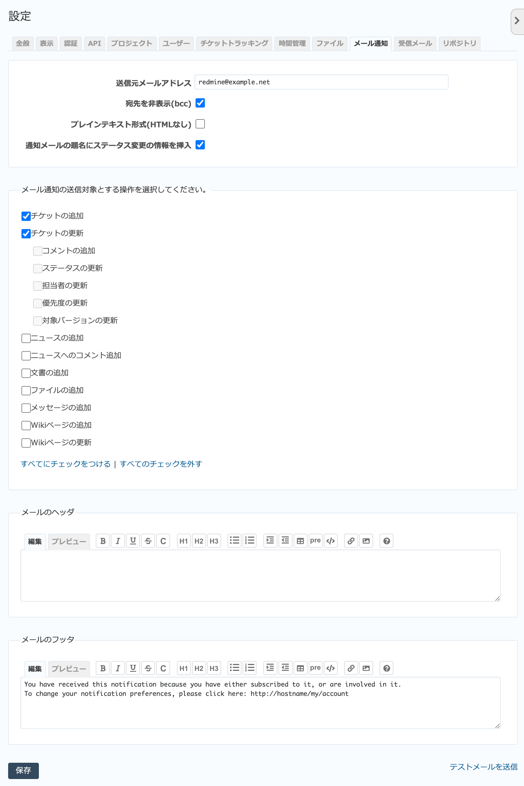

メール通知 タブ（管理→設定 画面）
--------------------------------------

メール通知の動作に関する全般的な設定を行います。

.. warning::
   メール通知の機能を利用するには、この画面での設定だけでなく、 :file:`config/configuration.yml` で送信に使うメールサーバなどの設定が必要です。

   「メール通知」タブ

.. list-table:: 「設定」→「メール通知」の入力項目
   :header-rows: 1

   * - 名称
     - 説明

   * - 送信元メールアドレス
     - RedMicaから送信されるメールのFromアドレスです。

       メールによるチケット登録の設定を行っている場合、チケット登録用のメールアドレスを設定してください。RedMicaからのメールに返信することでチケットの更新が行えます。

   * - 宛先を非表示(bcc)
     - ONの場合、メールの宛先(ヘッダのToフィールド)にユーザーのアドレスは表示されません。デフォルトはONです。

   * - プレインテキスト形式(HTMLなし)
     - ONの場合、メールをHTML形式ではなくプレインテキスト形式で送信します。プロジェクトメンバーがHTMLメールに対応していないメーラーを使っている時などに設定します。

   * - 通知メールの題名にステータス変更の情報を挿入
     - 通知メール件名に挿入される「（新規）」「（進行中）」などのステータス変更情報を表示するか設定します。

   * - メール通知の送信対象とする操作を選択してください。
     - どのような操作が行われたときにメールを送信するのか設定します。デフォルトではチケットが追加・更新されたときに送信されます。

   * - メールのヘッダ・フッタ
     - RedMicaから送信されるメールのヘッダ部・フッタ部に固定的に挿入する内容を指定します。

.. note::
   画面右下の :guilabel:`テストメールを送信` をクリックすると自分宛にテストメールが送信されます。RedMicaとメールサーバとの通信に問題があればこの画面にエラーが表示されるので、 :file:`config/configuration.yml` でのメール関係の設定に問題がないか確認してください。
