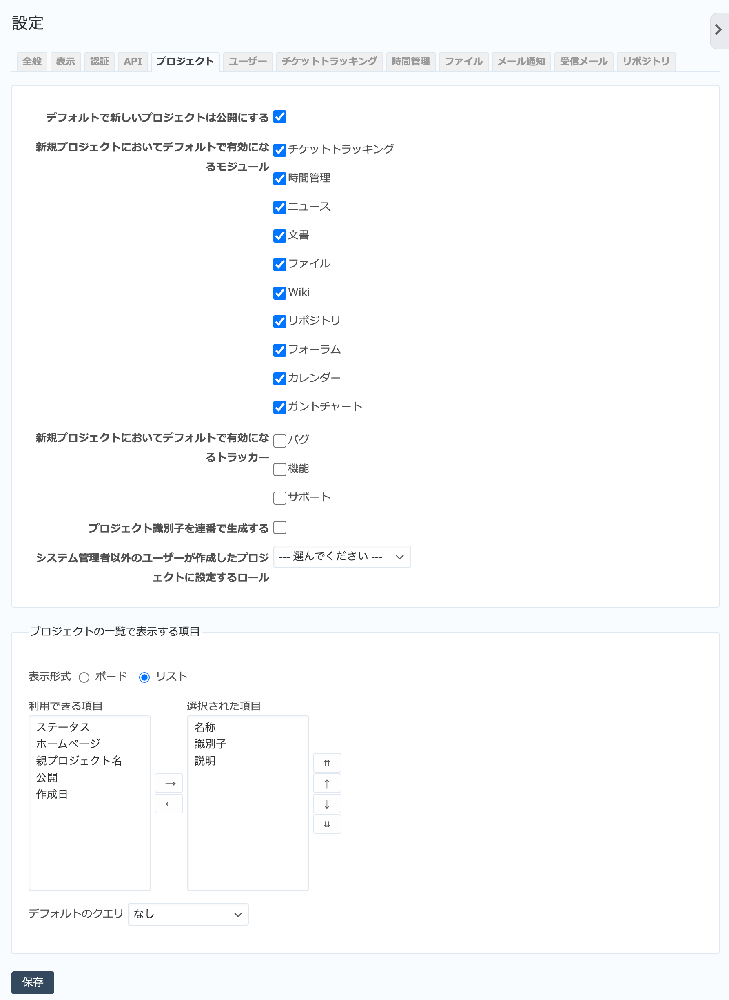

プロジェクト タブ（管理→設定 画面）
----------------------------------------

新たに作成するプロジェクトに関する設定を行います。

   「プロジェクト」タブ

.. list-table:: プロジェクトタブの入力項目
   :header-rows: 1

   * - 名称
     - 説明

   * - デフォルトで新しいプロジェクトは公開にする
     - ONの場合、新規に作成されたプロジェクトは公開プロジェクトとなります。公開プロジェクトにはRedMica上のすべてのユーザーがアクセスできます。 :menuselection:`管理 --> 設定 --> 認証` で :guilabel:`認証が必要` をOFFにしている場合は、未認証ユーザーもアクセスできます。デフォルト値はONです。

   * - 新規プロジェクトにおいてデフォルトで有効になるモジュール
     - 新しいプロジェクトを作成したとき、ここでチェックボックスがONになっているモジュールのみが有効に設定された状態となります。利用頻度が低いモジュールをOFFにしておけば、プロジェクトを作成する毎にわざわざOFFにする必要がなくなります。

   * - 新規プロジェクトにおいてデフォルトで有効になるトラッカー
     - 新しいプロジェクトを作成したとき、ここでチェックボックスがONになっているトラッカーのみが有効に設定された状態となります。汎用的に利用するトラッカーのみONにしておけば、プロジェクトを作成する毎にわざわざONにする必要がなくなります。

   * - プロジェクト識別子を連番で生成する
     - ONの場合、新しいプロジェクトを作成する際にプロジェクトの識別子を直近に作成したプロジェクトの識別子＋数値の形式で自動的に生成します。

   * - システム管理者以外のユーザーが作成したプロジェクトに設定するロール
     - あるプロジェクトの「管理者」ロールのメンバーは、そのプロジェクトのサブプロジェクトに限ってはシステム管理者権限を持っていなくても作成できます。この機能を使って新たに作成したプロジェクトにおいて、プロジェクト作成を行ったユーザーをどのロールでメンバーとするのか指定します。

   * - プロジェクトの一覧で表示する項目
     - プロジェクト一覧画面のデフォルトの表示形式と表示する項目を設定します。表示形式は「ボード」または「リスト」から選択できます。表示形式が「リスト」の場合のみ「選択された項目」がプロジェクト一覧画面に表示されます。「デフォルトのクエリ」はプロジェクト一覧画面でデフォルトで表示するカスタムクエリをRedmine全体で設定します。
