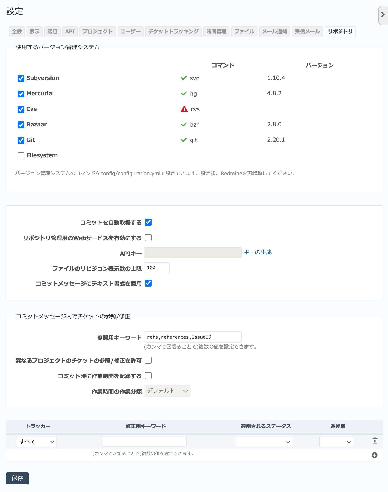

リポジトリ タブ（管理→設定 画面）
--------------------------------------

SubversionやGitなど、バージョン管理システムとの連携に関する全般的な設定を行います。

.. note::
   どのリポジトリを参照するかなどバージョン管理システムに関するプロジェクト固有の設定は、プロジェクトメニューの「設定」→「リポジトリ」で行います。

   「リポジトリ」タブ

.. list-table:: リポジトリタブの入力項目
   :header-rows: 1

   * - 名称
     - 説明

   * - 使用するバージョン管理システム
     - 連携に使用する可能性のあるバージョン管理システムを選択してください。ここで選択したバージョン管理システムがプロジェクトの :menuselection:`設定 --> リポジトリ` 画面の選択肢として表示されます。

   * - コミットを自動取得する
     - リポジトリからコミットの情報を取得する方法を指定します。ONの場合、 :guilabel:`リポジトリ` 画面を開いたタイミングで情報を自動取得します。

       サーバで定期的に :kbd:`rake redmine:fetch_changesets` を実行するなどして外部で定期的に情報を取得する設定を行っている場合はOFFにしてください。 :guilabel:`リポジトリ` 画面を開くのにかかる時間を短縮できます。

   * - リポジトリ管理用のWebサービスを有効にする
     - RedMica添付の :file:`reposman.rb` を使ってSubversionリポジトリをRedMicaのプロジェクトと連動して自動作成させるときやコミットフックでリポジトリの情報を自動取得する設定を行うときにONにします。

   * - APIキー
     - コミットフックなどでリポジトリ情報を自動取得する設定を設定を行う際に必要になるAPIキーを設定します。

   * - ファイルのリビジョン表示数の上限
     - 特定のファイルのリビジョン一覧を表示する際のリビジョン数の上限です。

   * - コミットメッセージにテキスト書式を適用
     - コミットメッセージにテキスト書式を使用するか設定します。

   * - 参照用キーワード
     - バージョン管理システムのコミットメッセージ内でRedMicaのチケット番号を参照する際に使用するキーワードを指定します。

   * - 異なるプロジェクトのチケットの参照/修正を許可
     - コミットメッセージ内に参照用キーワード・修正用キーワードを含めてチケットと関連づけを行う際、別のプロジェクトのチケットとの関連づけも許可します。

   * - コミット時に作業時間を記録する
     - コミットメッセージ内に参照用キーワード・修正用キーワードとともに作業時間を記録することで、そのチケットに作業時間を記録することを許可します。

   * - 作業時間の作業分類
     - コミットメッセージで作業時間を記録する際、どの作業分類で記録するのか指定します。

   * - 修正用キーワード
     - バージョン管理システムのコミットメッセージ内でRedMicaのチケット番号を指定してチケットの状態を変更させる際に使用するキーワード、そしてキーワードが使われた際にどのようにチケットの状態を変化させるのかを指定します。同じ修正用キーワードでもトラッカーごとに動作を変えることもできます。

       **トラッカー:**
       どのトラッカーに対して修正用キーワードを適用するのか選択します。

       **適用されるステータス:** 修正用キーワードが指定されたときにチケットのステータスをどう変化させるのか指定します。

       **進捗率:** 修正用キーワードが指定されたときに進捗率を何％にセットするのかを指定します。
