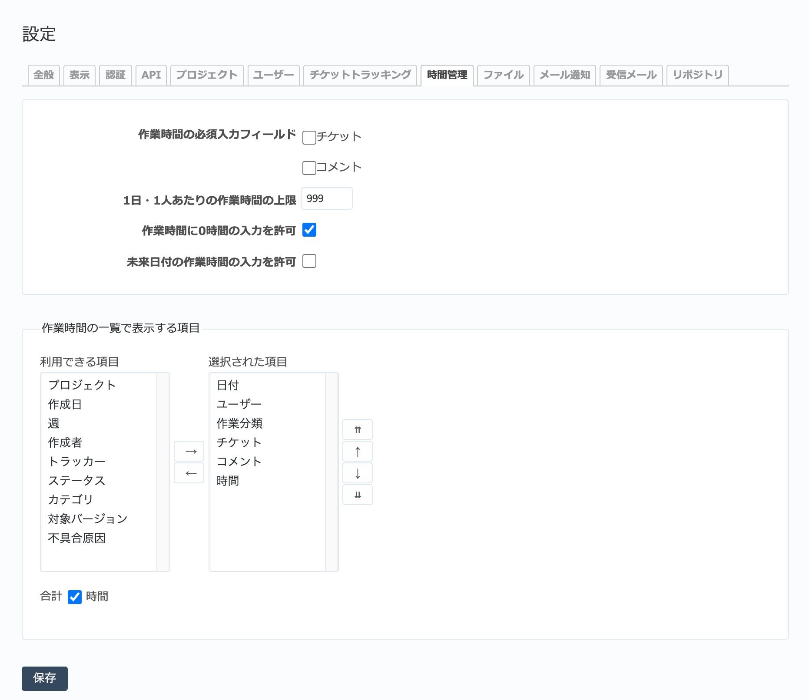

時間管理 タブ（管理→設定 画面）
------------------------------------

時間管理に関する全般的な設定を行います。

  「時間管理」タブ

.. list-table:: 「設定」→「時間管理」の入力項目
  :header-rows: 1

  * - 名称
    - 説明

  * - 作業時間の必須入力フィールド
    - 作業時間の入力時にチケット番号、コメント欄を必須入力にするか設定します。

  * - 1日・1人あたりの作業時間の上限
    - 各ユーザーが1日に入力できる合計作業時間に上限を設定します。例えば 8 にすれば、1人のユーザーが1日に合計8時間を超える作業時間を入力できなくなります。

  * - 作業時間に0時間の入力を許可
    - 作業時間に0時間の入力を許可するか設定します。

  * - 未来日付の作業時間の入力を許可
    - OFFにすると、未来の日付で作業時間を入力できなくなります。

  * - 作業時間の一覧で表示する項目
    - 作業時間の一覧画面でデフォルトで表示する項目を設定します。
