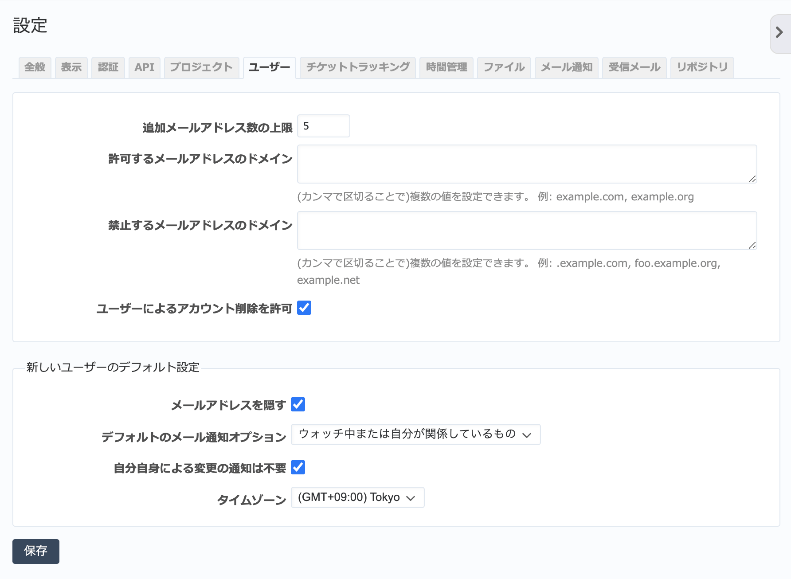

ユーザー タブ（管理→設定 画面）
------------------------------------

ユーザーに関する設定を行います。

  「ユーザー」タブ

.. list-table:: ユーザータブの入力項目
  :header-rows: 1

  * - 名称
    - 説明

  * - 追加メールアドレス数の上限
    - ユーザーに追加で設定できるメールアドレス数の上限を設定します。

  * - 許可するメールアドレスのドメイン
    - ユーザーのメールアドレスの許可するドメインを設定します。入力したドメインのメールアドレス以外は設定できません。個人用のメールアドレスの設定を禁止して組織外への情報漏洩を防ぐのに役立ちます。

  * - 禁止するメールアドレスのドメイン
    - ユーザーのメールアドレスの禁止するドメインを設定します。入力したドメインのメールアドレス以外を設定できます。

  * - ユーザーによるアカウント削除を許可
    - ONにすると、ユーザーは :guilabel:`個人設定` 画面で自分のアカウントを削除できるようになります。

  * - メールアドレスを隠す
    - ONにすると、ユーザー名をクリックした時に表示されるユーザー詳細画面で他のユーザーにメールアドレスが表示されません。

  * - デフォルトのメール通知オプション
    - 新しいユーザーを作成した際、そのユーザーに設定するデフォルトのメール通知オプションを選択します。

  * - 自分自身による変更の通知は不要
    - ONにすると、ユーザー作成時にデフォルトで自分自身が行った操作についての通知メールを送らないよう設定します。

  * - タイムゾーン
    - ユーザー作成時のデフォルトのタイムゾーンの設定です。
