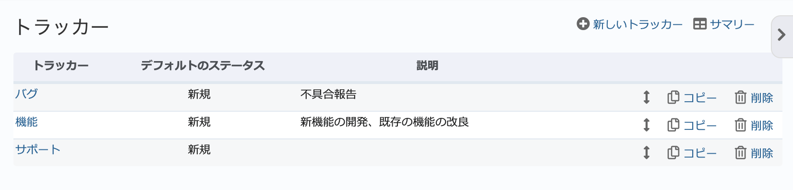
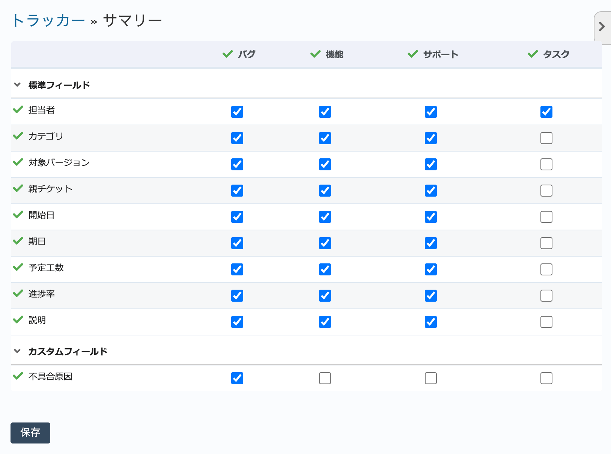

トラッカー（管理 画面）
------------------------

トラッカーとは、簡単に言えばチケットの種別を定義するものです。デフォルトでは「バグ」、「機能」、「サポート」の3つのトラッカーが定義されています。一見チケットの大分類のように見えますが、単なる分類ではなく、チケットの以下の性質を定義するものです。

標準フィールドの使用・不使用
  トラッカーごとに、開始日・期日・予定工数などの標準フィールドを使用するかどうか定義できます。

カスタムフィールドの使用・不使用
  トラッカーごとに、そのRedMicaで定義されたカスタムフィールドを使用するかどうか定義できます。

ワークフロー（チケットでどのステータスを使用するか）
  ワークフローはプロジェクトのメンバーがチケットのステータスをどのように遷移させることができるのかを定義するためのものです。ロールとトラッカーの組み合わせごとに定義されています（ワークフロー数 ＝ ロール数 × トラッカー数）。ワークフローの定義により、チケットで利用可能なステータスが定まります。

フィールドの権限（フィールドの必須入力・読み取り専用の制御）
  ロール、トラッカー、ステータスの組み合わせにより、個々の標準フィールドの権限（必須入力・読み取り専用）を定義できます。

このように、トラッカーによって、チケットにどのような情報を入力できるのか、どんなステータスが
選択できるのかが制御できます。トラッカーは単なる分類ではなく、入力フォームの定義と言えます。

.. note:: ワークフローの新たな定義が不要で、単純にチケットを分類したいだけであればカテゴリやカスタムフィールドの利用も検討してください。

.. list-table:: デフォルトで定義されているトラッカー
   :header-rows: 1

   * - トラッカー名
     - 説明

   * - バグ
     - バグや障害などを登録します。

   * - 機能
     - 新たに機能を開発したり、既存の機能を改良したりといったタスクを登録します。

   * - サポート
     - 資料作成など開発に直接関係のない(コードの修正を伴わない)支援業務などを登録します。

トラッカー一覧画面
******************

管理画面で「トラッカー」をクリックするとトラッカー一覧画面に移動します。トラッカーの新規作成、既存トラッカーの編集、削除が行えます。

    トラッカー一覧画面

新しいトラッカーの作成
**********************

トラッカー一覧画面で右上の「新しいトラッカー作成」をクリックすると、「新しいトラッカーを作成」画面に移動します。

.. warning::
  新たにトラッカーを作成したら、そのトラッカーに対するワークフローの定義も必要です。ワークフローの定義を行わないと、そのトラッカーのチケットはステータスを :dfn:`新規` から変更できません。

  ワークフローをトラッカーに対して定義するには、トラッカーを作成するときに「ワークフローをここからコピー」で既存のトラッカーからワークフローをコピーするか、 :guilabel:`ワークフロー` 画面で設定します。

.. figure:: ../images/trackers-new.png

    「新しいトラッカー」画面

.. list-table:: 「新しいトラッカー」画面の入力項目
    :header-rows: 1

    * - 名称
      - 説明

    * - 名称
      - トラッカーの名称です。新しいチケットを作成する際の選択肢などに表示されます。

    * - デフォルトのステータス
      - 新しいチケットを作成する時にデフォルトで選択されるステータスを指定します。

    * - チケットをロードマップに表示する
      - ONの場合、このトラッカーのチケットが「ロードマップ」画面で各バージョンの「関連するチケット」欄に表示されます。

        デフォルトではトラッカー「機能」のみONになっており、ロードマップ画面ではそのバージョンで新規に追加される機能が一目でわかるようになっています。

    * - 説明
      - トラッカーを説明する文章を入力します。説明の内容はチケット画面のトラッカー選択項目の？マークに表示されます。

    * - 標準フィールド
      - 標準フィールドのうちこのトラッカーで使用するものを指定します。

        チェックボックスをOFFにすることで、開始日・期日・予定工数などの標準フィールドのうち使わないものを非表示にできます。

    * - カスタムフィールド
      - カスタムフィールドのうちこのトラッカーで使用するものを指定します。

        チェックボックスをOFFにすることで、カスタムフィールドのうち使わないものを非表示にできます。

    * - ワークフローをここからコピー
      - ワークフローとはプロジェクトのメンバーがチケットのステータスをどのように変更できるか定義したもので、ロールとトラッカーの組み合わせ毎に定義されています。「ワークフローをここからコピー」でコピー元のトラッカーを選択すると、コピー元と同じ内容のワークフローが新しトラッカーに対して作成されます。

    * - プロジェクト
      - このトラッカーをどのプロジェクトで使用するのか指定します。新たに作成したトラッカーを既存のプロジェクトで使うためにはこの画面で使用するプロジェクトを指定するか、プロジェクトの設定画面の :guilabel:`チケットトラッキング` タブで使用するトラッカーを選択してください。

トラッカーの編集
****************

トラッカー一覧画面でトラッカー名をクリックすると、トラッカーの設定内容の編集を行うための画面が表示されます。入力項目は新しいトラッカーの作成画面とほぼ同じです。

トラッカーのコピー
******************

トラッカー一覧画面で「コピー」をクリックすると、そのトラッカーの設定内容が入力された「新しいトラッカー作成」画面が表示されます。すでに作成済みのトラッカーの設定を参考にしながら作成するのに便利です。

トラッカーの削除
****************

トラッカー一覧画面で「削除」をクリックするとそのトラッカーを削除できます。

ただし、そのトラッカーを使っているチケットが存在しているとトラッカーを削除することができません。トラッカーを削除する前にそのチケットのトラッカーを変更し、そのトラッカーを使っているチケットが無い状態にしてください。

サマリーの表示
**************

トラッカー一覧画面の左下にある「サマリー」をクリックすると、すべてのトラッカーでどの標準フィールド・カスタムフィールドが使われているのかを示す表が表示されます。この画面でも使用する標準フィールド・カスタムフィールドの設定が行えます。

    トラッカーの「サマリー」
