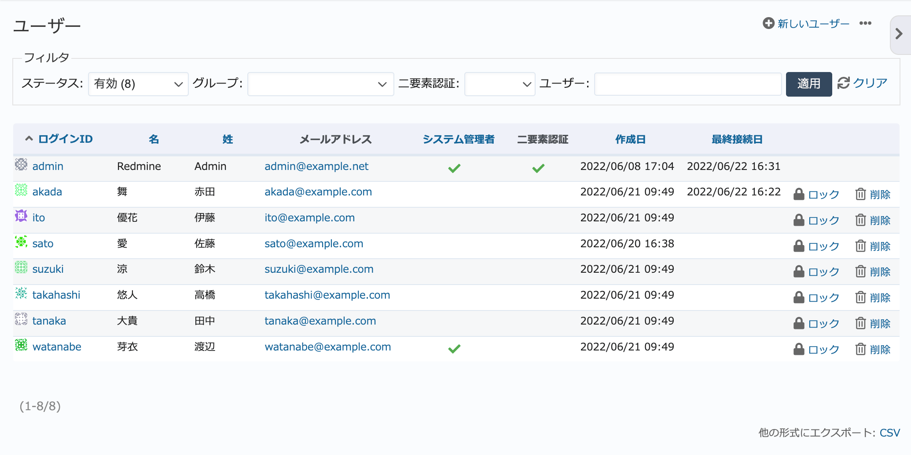
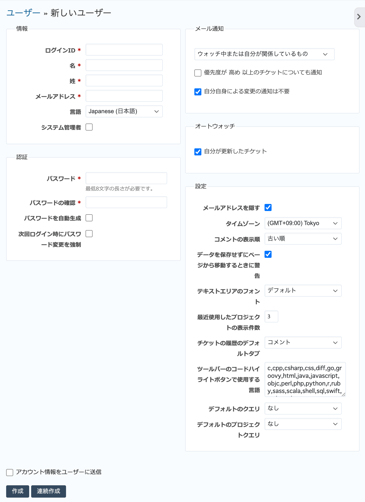
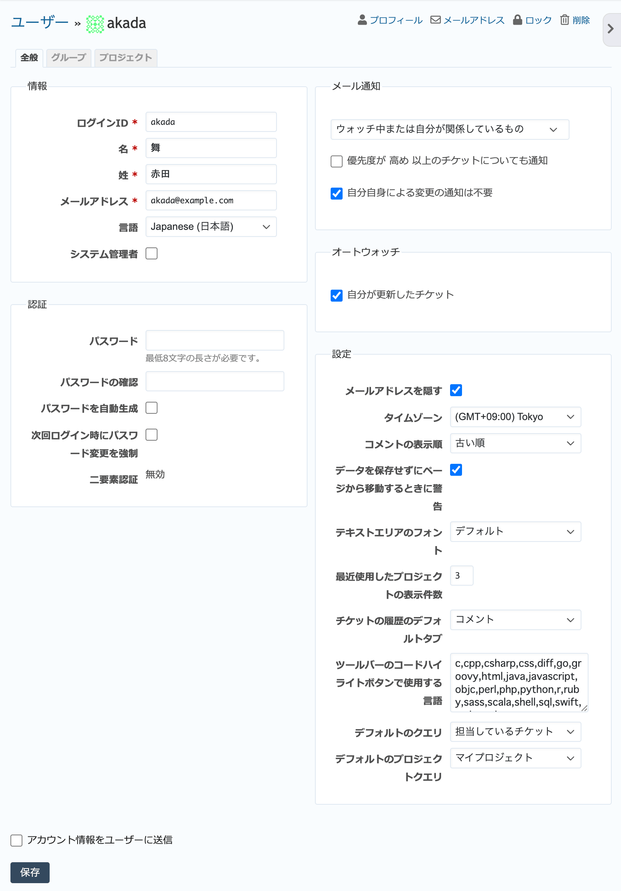

ユーザー（管理 画面）
----------------------

新しいユーザーの作成や、既存ユーザーの設定変更・ロックなどを行います。

ユーザー一覧画面
****************

管理画面で「ユーザー」をクリックするとユーザー一覧画面に移動します。

    ユーザー一覧画面

表示されるユーザーの一覧は「フィルタ」により絞り込まれていて、デフォルトでは :dfn:`有効` が適用されています。フィルタの動作は次の表の通りです。

.. list-table:: ユーザー一覧画面のフィルタの動作
    :header-rows: 1

    * - ステータス
      - 説明

    * - すべて
      - すべてのユーザーが表示されます。

    * - 有効
      - 現在利用可能なユーザー（ステータスが「登録」または「ロック」でないもの）が表示されます。ユーザー一覧画面を開いた直後は「有効」が選択されています。

    * - 登録
      - ユーザー自身による登録を許可している場合に、登録の申請があったものの有効化されていないアカウントが表示されます。

    * - ロック中
      - ロックされているアカウントが表示されます。

新しいユーザーの作成
********************

画面右上の :guilabel:`新しいユーザー` をクリックすると、新たなユーザーを作成するための画面が表示されます。

    「新しいユーザー」画面

.. list-table:: 「新しいユーザー」画面の主な入力項目
    :header-rows: 1

    * - 名称
      - 説明

    * - ログインID
      - RedMicaにログインする際に使用するログインIDです。

    * - 名
      - 氏名の名前部分です。

        名前・名字の入力の順序が日本語における通常の標記と逆になっています。注意してください。

    * - 姓
      - 氏名の苗字部分です。

    * - メールアドレス
      - ユーザーのメールアドレスです。ユーザー作成時のパスワードの通知やチケットのメール通知に使用されます。

        メールアドレスは一つのRedMica上で一意でなければなりません。同じメールアドレスのユーザーを複数作成することはできません。

    * - 言語
      - RedMicaのGUIを表示するための言語です。デフォルトは :menuselection:`管理 --> 設定 --> 表示` 画面で指定した「デフォルトの言語」です。

        「(auto)」を選択するとブラウザの設定に応じた言語が自動選択されます。

    * - システム管理者
      - ユーザーにシステム管理者権限を与える場合にチェックをONにします。システム管理者権限とは、端的に言えばトップメニューの「管理」を開くことができる権限で、プロジェクトやユーザーの作成・編集・削除、そのほかRemdine全体にかかわる設定が行えます。

    * - パスワード
      - ユーザーに設定するパスワードを入力します。パスワードはある一定の文字数以上でなければなりません。

        パスワードの最低必要文字数は :menuselection:`管理 --> 設定 --> 認証` 画面で変更できます。

    * - アカウント情報をユーザーに送信
      - ONの状態だと、ユーザー作成後、ユーザーのメールアドレス宛にRedMicaを利用するために必要なログインID、パスワード、RedMicaのURLが記載されたメールが送信されます。

ユーザーの編集
**************

ユーザー一覧画面でログインIDをクリックすると、ユーザーの情報の変更やプロジェクトへの参加などの操作を行う画面に移動します。この画面には :guilabel:`全般`, :guilabel:`グループ`, :guilabel:`プロジェクト` の三つのタブがあります。

「全般」タブではユーザーのログインID、氏名、メールアドレス、パスワードなどユーザーの新規作成時に入力した情報の編集が行えます。

    ユーザーの編集画面(「全般」タブ)

「グループ」タブではユーザーが所属するグループの追加や変更ができます。

.. figure:: ../images/users-edit-group.png

    ユーザーの編集画面(「グループ」タブ)

「プロジェクト」タブではユーザーがメンバーとして参加するプロジェクトの追加や変更ができます。

.. figure:: ../images/users-edit-project.png

    ユーザーの編集画面(「プロジェクト」タブ)

ユーザーのロック
****************

ユーザー一覧画面でユーザーのロックを行うと、そのユーザーはRedMicaにアクセスできなくなります。また、プロジェクトのメンバー一覧にも表示されなくなります。

ユーザーの削除
**************

ユーザーをRedMicaから削除します。

.. warning::
    ユーザーを削除すると、それまでそのユーザーが作成・更新した情報は作成者・更新者が :dfn:`匿名ユーザー` になってしまい、誰が作成・更新したのか分からなくなってしまいます。

    特別な理由が無い限り削除ではなくロックを行うことをお勧めします。
