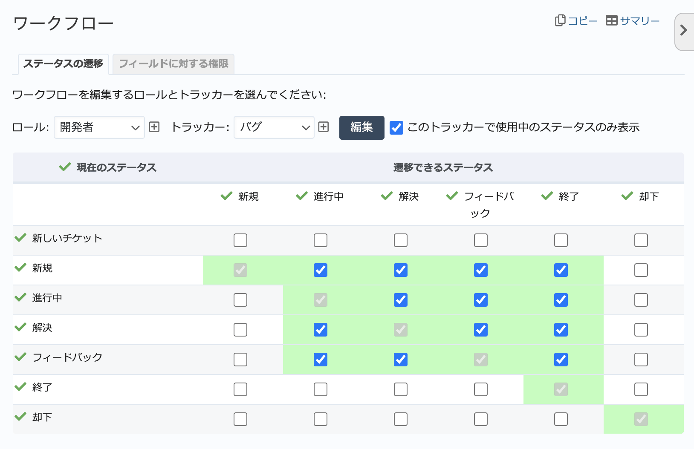
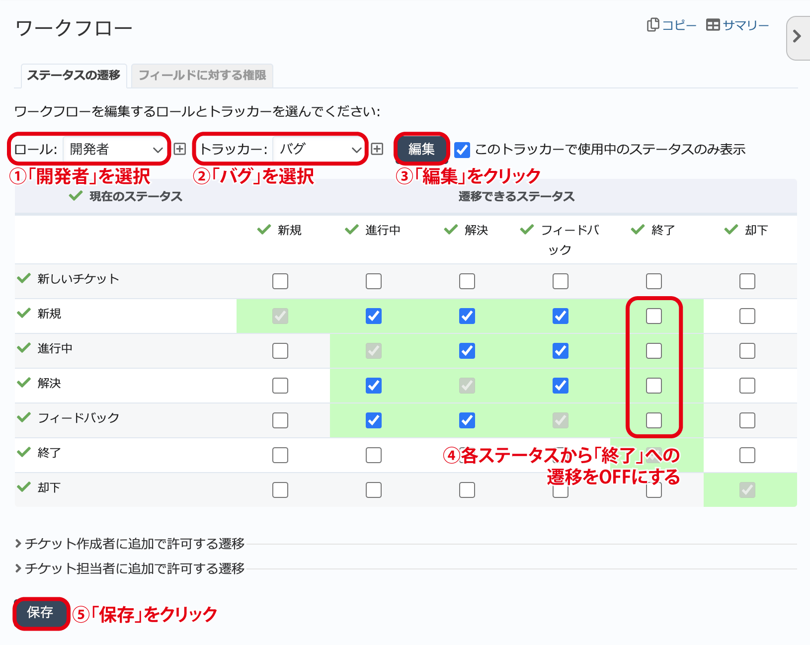
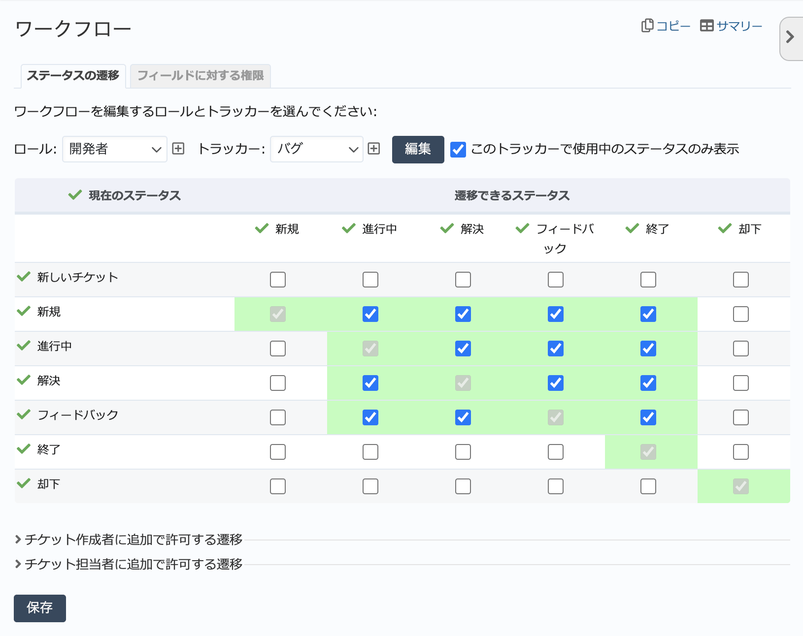
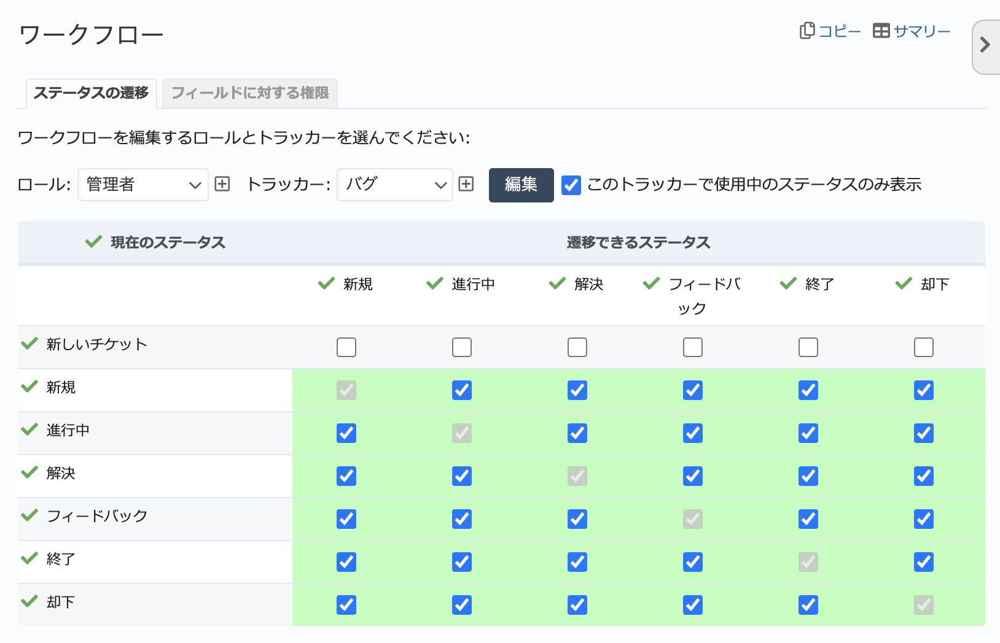
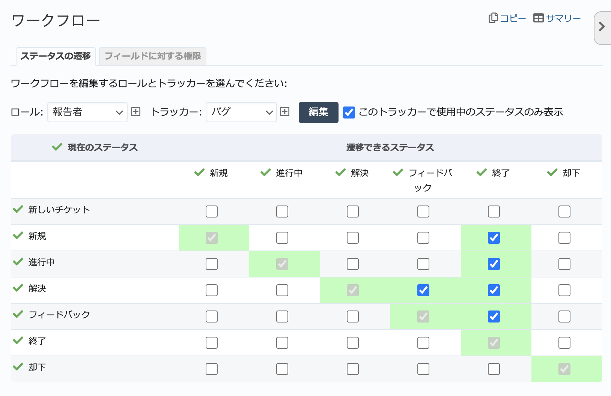

ステータスの遷移（管理→ワークフロー 画面）
--------------------------------------------

ワークフローはプロジェクトのメンバーがチケットのステータスをどのように遷移させることができるのかを定義したものです。例えば、ステータス :dfn:`進行中` のチケットを :dfn:`終了` にできるのを :dfn:`管理者` ロールのメンバーに限定するなどの設定ができます。

ワークフローはロールとトラッカーの組み合わせごとに定義します(ワークフロー数 ＝ ロール数 × トラッカー数)。

デフォルトのワークフロー例
**************************

ワークフロー画面では、どのようにステータスを遷移させることができるのかがチェックボックスによる表で表現されています。

以下の図はデフォルトのワークフローのうちロール「開発者」・トラッカー「バグ」に対するワークフローです。次のようなステータス遷移は行えません。

* :dfn:`新規` に変更
* :dfn:`却下` に変更
* :dfn:`終了` ・ :dfn:`却下` からほかのステータスに変更

    ロール「開発者」・トラッカー「バグ」のデフォルトのワークフロー

ワークフローのカスタマイズ例
****************************

前述のロール「開発者」・トラッカー「バグ」のワークフローを次のように変更することを考えてみます。

* 開発者ロールのメンバーはステータスを :dfn:`終了` には変更できない

開発者ロールのメンバーは自分でチケットのステータスを :dfn:`終了` にするのではなく、作業が終わったらステータスを :dfn:`解決` に設定し、管理者ロールのメンバーがレビューを行った後に :dfn:`終了` とすることを想定しています。

そのような設定は、下図のようにロール「開発者」・トラッカー「バグ」のワークフローを編集し、各ステータスから :dfn:`終了` への遷移に対応するチェックボックスをOFFにすることで実現できます。

    ワークフローのカスタマイズ

ワークフロー画面
****************

管理画面で「ワークフロー」をクリックすると、指定したロールとトラッカーの組み合わせに対するワークフローが編集できるワークフロー画面に移動します。

    ワークフロー画面

.. list-table:: ワークフロー画面の入力項目
  :header-rows: 1

  * - 名称
    - 説明

  * - ロール・トラッカー
    - どのロールとトラッカーの組み合わせに対してワークフローを編集するのか指定します。

  * - このトラッカーで使われているステータスのみ表示
    - ONの場合、選択したトラッカーで使われていないステータス(どのロールとの組み合わせのワークフローでもチェックボックスがONになっていないステータス)は表示しません。

      新しく作成したステータスに対する遷移を定義するためには、このチェックボックスをOFFにしてください。

ワークフローの編集
******************

ワークフロー画面でロールとトラッカーの組み合わせを選択して「編集」ボタンをクリックすると、あるステータスからどのステータスに遷移できるかの組み合わせをチェックボックスで表現した表が表示されます。

表の左端に縦に並んでいるのが現在のステータス、最上部に横に並んでいるのが遷移先のステータスを意味しており、遷移が可能な組み合わせはチェックボックスがONになっています。

.. list-table:: チケットの作成・更新時に選択可能なステータス
    :header-rows: 1

    * - 状況
      - 選択可能なステータス

    * - 新しいチケットを作成するとき
      - #. :menuselection:`管理 --> トラッカー` で :dfn:`デフォルトのステータス` として設定されているステータス(通常は :dfn:`新規`)
        #. ワークフローで現在のステータスが「新しいチケット」からの遷移先と指定されているステータス

    * - 既存チケットのステータスを変更するとき
      - ワークフローで現在のステータスからの遷移先として指定されているステータス。

次の図では「現在のステータス」と「遷移できるステータス」が等しい組み合わせ、「現在のステータス」が「新しいチケット」の遷移先以外はすべてONになっています。「新規」→「新規」、「進行中」→「進行中」のような意味のない組み合わせを除いた組み合わせ、新しいチケット作成時はトラッカー「バグ」のデフォルトのステータスのみステータス遷移が可能です。

    ロール「管理者」・トラッカー「バグ」のデフォルトのワークフロー

次の図は、ロール「報告者」・トラッカー「バグ」に対するワークフローです。次の操作のみが行えます。

* ステータスが「新規」のチケットを作成する（例: テストの結果発見されたバグの報告）
* ステータスを「新規」「進行中」「解決」「フィードバック」から「終了」にする（例: 開発者による修正内容を確認後、チケットを終了させる）
* ステータスを「解決」から「フィードバック」にする（例: 開発者が修正したと報告したものについて問題を発見し差し戻す）。

    ロール「報告者」・トラッカー「バグ」のデフォルトのワークフロー
