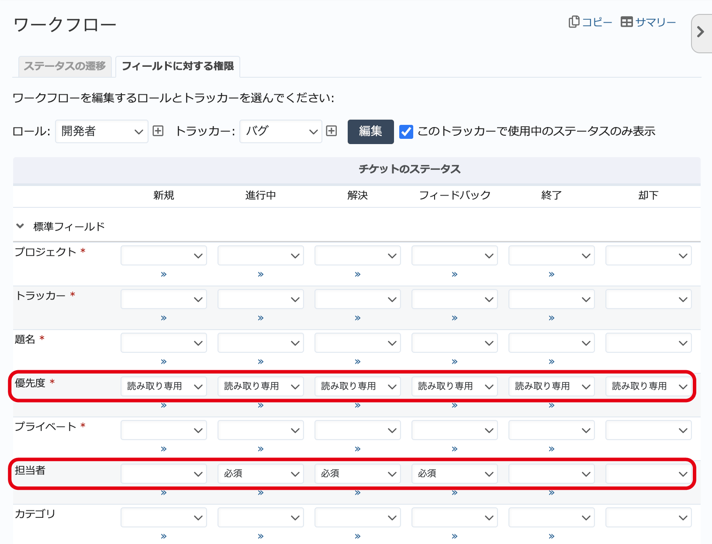

フィールドに対する権限（管理→ワークフロー 画面）
-------------------------------------------------

ワークフロー画面の :guilabel:`フィールドに対する権限` タブでは、トラッカー・ロール・ステータスごとに担当者や期日などの標準フィールドやカスタムフィールドを必須に設定したり読み取り専用に設定できます。チームにおけるRedMicaの運用にあわせて特定の項目の入力を強制したり、変更を禁止したりできます。

例えば、次のような運用が実現できます。

* 「新規」「却下」以外のチケットは担当者の入力を必須とし、作業中のチケットの担当者の設定忘れを防止
* チケットの開始日・期日を管理者ロール以外のユーザーは読み取り専用として、それ以外のメンバーが勝手に変更するのを禁止
* チケットの優先度を管理者ロール以外のユーザーは読み取り専用として、それ以外のメンバーが勝手に変更するのを禁止

   フィールドに対する権限の設定例
