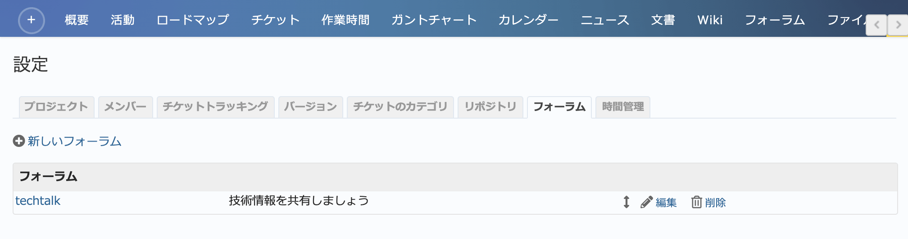
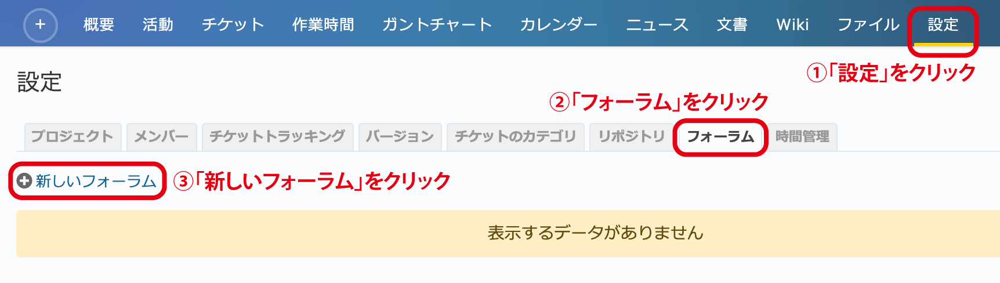
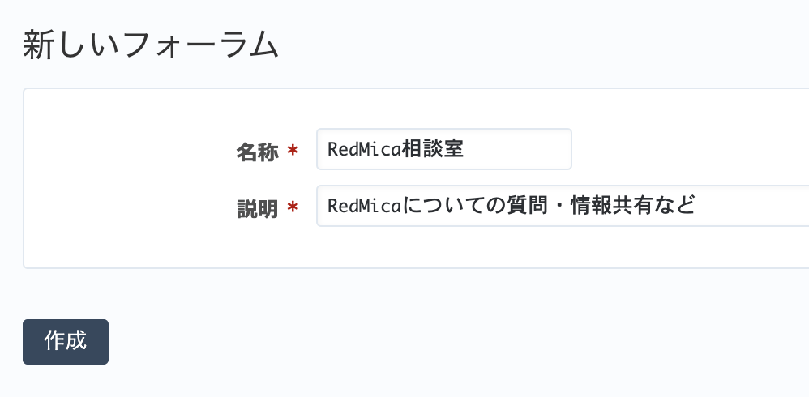

フォーラム タブ（プロジェクトの設定）
-------------------------------------

フォーラムの新規作成、編集、削除を行うための画面です。

    「設定」→「フォーラム」タブ

フォーラムの作成
****************

新たにフォーラムを作成するには、プロジェクトメニューから :menuselection:`設定 --> フォーラム` を開き、 画面左下の :guilabel:`新しいフォーラム` をクリックしてください。 :guilabel:`新しいフォーラム` 画面が開くので、フォーラムの名称と説明を入力して :guilabel:`作成` をクリックしてください。

   フォーラムの作成1

   フォーラムの作成2

.. warning::
   フォーラムの作成を行うには :dfn:`フォーラムの管理` 権限が必要です。この権限は、デフォルトでは :dfn:`管理者` ロールに割り当てられています。権限の割り当ての確認や変更は :menuselection:`管理 --> ロールと権限 --> 権限レポート` で行えます。
