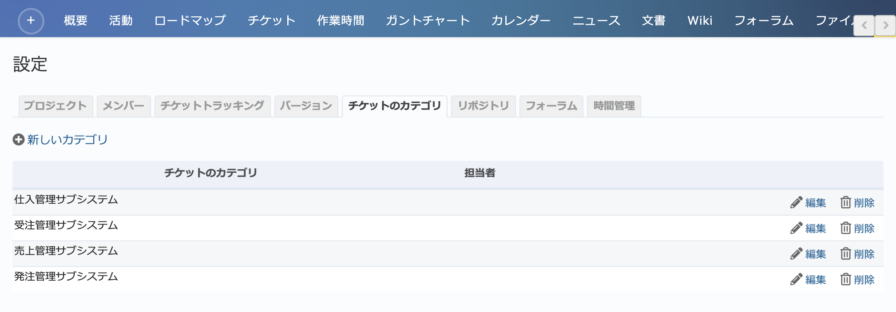
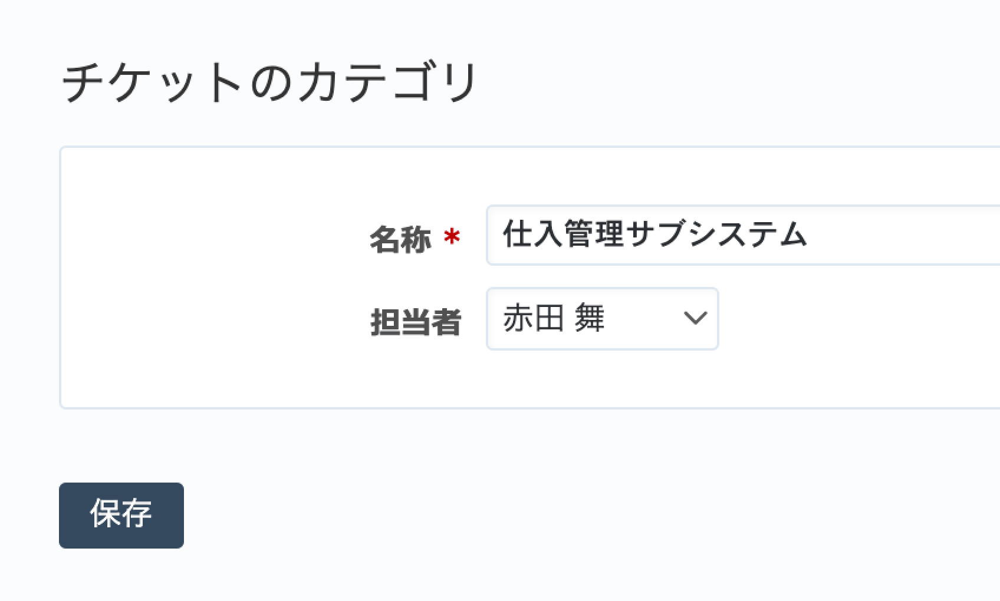

チケットのカテゴリ タブ（プロジェクトの設定）
---------------------------------------------

チケットを分類するためのカテゴリの新規作成、編集、削除を行います。

    「設定」→「カテゴリ」タブ

カテゴリの作成・編集
**********************

新たにカテゴリを作成するには画面左上の「新しいカテゴリ」をクリックしてください。既存のカテゴリを編集するには、編集したいカテゴリの右側に表示されている「編集」をクリックしてください。

    カテゴリの作成・編集画面

.. list-table:: カテゴリの作成・編集画面の入力項目
    :header-rows: 1

    * - 名称
      - 説明

    * - 名称
      - カテゴリの名称です。

    * - 担当者
      - カテゴリの担当者です。担当者が割り当てられたカテゴリを選択して新たなチケットを作成すると、カテゴリの担当者と同じユーザーがチケットの担当者になります。
