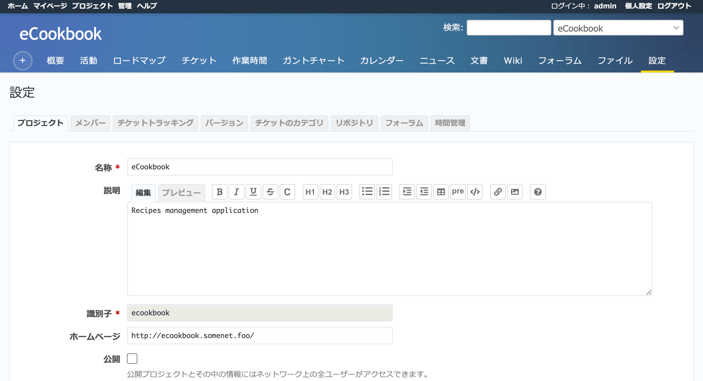

プロジェクトの設定
==================

プロジェクトを開いた状態でプロジェクトメニューの :guilabel:`設定` をクリックすると、そのプロジェクトに関する設定等を行う画面が表示されます。この画面は :dfn:`管理者` ロールなどのプロジェクト管理権限をもったユーザーのみがアクセスできます。

   プロジェクトの設定画面

.. toctree::
   :maxdepth: 1

   info.rst
   members.rst
   issues.rst
   versions.rst
   categories.rst
   repositories.rst
   boards.rst
   activities.rst
