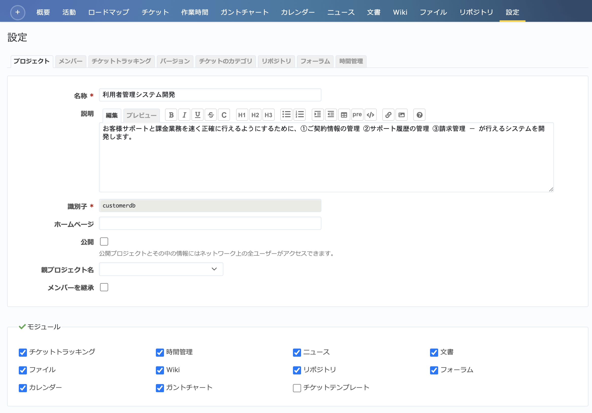

プロジェクト タブ（プロジェクトの設定）
---------------------------------------

プロジェクト名、説明などプロジェクトに関する基本的な情報の設定を行います。

   「設定」→「プロジェクト」タブ

.. list-table:: 設定→プロジェクト画面の表示項目
   :header-rows: 1

   * - 名称
     - 説明

   * - 名称
     - プロジェクトの名前です。ここで設定した名前がプロジェクトセレクタや各画面の左上などに表示されます。

   * - 説明
     - プロジェクトについての簡単な説明です。 :guilabel:`概要` 画面, :guilabel:`プロジェクト` 画面などで表示されます。

   * - 識別子
     - URLの一部などに使用されるプロジェクト識別子が表示されます。識別子は新たにプロジェクトを作成するときのみ指定可能です。後で変更することはできません。

   * - ホームページ
     - プロジェクトに関連するWebサイトがあればURLを入力します。 :guilabel:`概要` 画面で表示されます。

   * - 公開
     - チェックボックスをONにすると公開プロジェクトになります。プロジェクトのメンバーとして追加されていないユーザーもプロジェクトの情報を閲覧することができるようになります。 :menuselection:`管理 --> 設定 --> 認証` 画面で :guilabel:`認証が必要` を「いいえ」にしている場合は、ログインしていない状態でもプロジェクトを閲覧できます。

   * - 親プロジェクト名
     - 作成済みのプロジェクトのサブプロジェクトとして新しく作成する場合に選択します。

   * - メンバーを継承
     - 親プロジェクトのメンバーを子プロジェクトで継承できる設定です。ONにすると親プロジェクトのメンバーがこのプロジェクトにもアクセスできるようになります。

   * - モジュール
     - プロジェクトで使用する機能を選択します。デフォルトではすべての機能がONになっています。利用予定のない機能をOFFにして利用者の混乱を防いだり、運用方針上使ってほしくない機能を隠したりできます。プラグインによってはこの画面に新たなモジュールを追加するものもあります。そのようなプラグインは、プラグインの機能を利用するかどうかをプロジェクトごとにこの画面で設定できます。
