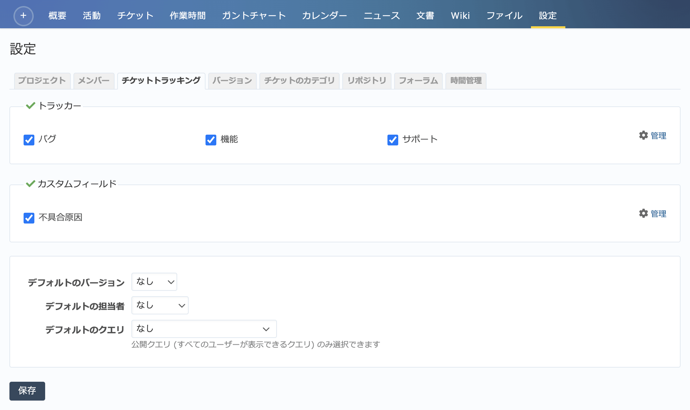

チケットトラッキング タブ（プロジェクトの設定）
-----------------------------------------------

プロジェクトで使用するトラッカー、カスタムフィールドなどの設定を行います。

   「設定」→「チケットトラッキング」タブ

.. list-table:: 設定→チケットトラッキング画面の表示項目
   :header-rows: 1

   * - 名称
     - 説明

   * - トラッカー
     - RedMicaに登録されているトラッカーのうち、このプロジェクトで使用するものを選択します。

   * - カスタムフィールド
     - RedMicaに登録されているカスタムフィールドのうち、このプロジェクトで使用するものを選択します。

   * - デフォルトのバージョン
     - チケットを作成するときにデフォルトで選択されるバージョンを設定します。

   * - デフォルトの担当者
     - チケットを作成するときにデフォルトで選択される担当者を設定します。デフォルトの担当者を設定しておくと、担当者を選択せずにチケットを作成したときに自動で担当者が割り当てられます。
