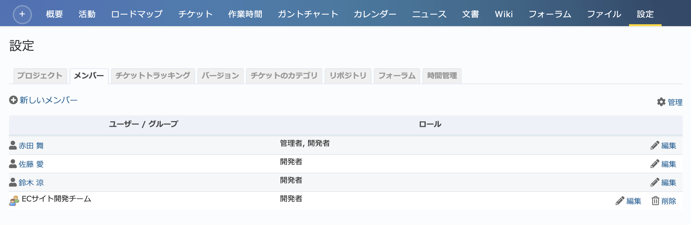
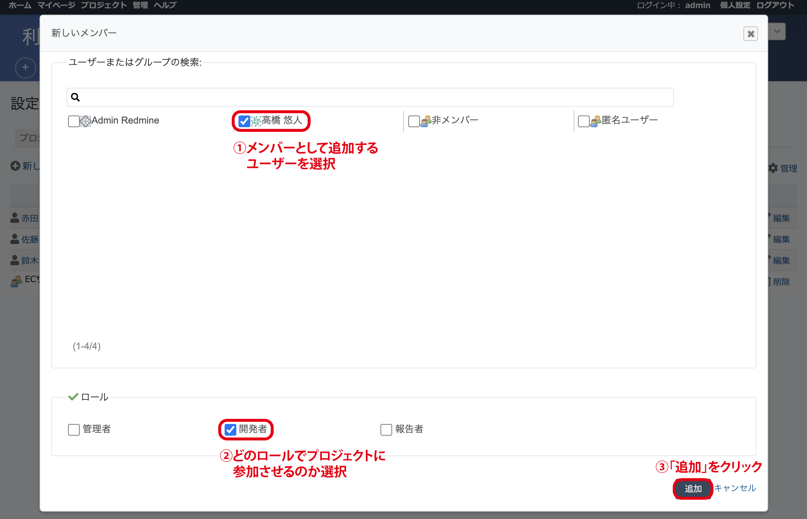

メンバー タブ（プロジェクトの設定）
-----------------------------------

プロジェクトにメンバーとして追加されているユーザーおよびグループ、そしてそのロールを表示します。また、メンバーの追加や削除も行えます。

   「設定」→「メンバー」タブ

メンバーの追加
**************

画面左上の「新しいメンバー」をクリックして追加したいユーザーまたはグループを選択し、次にそのユーザーまたはグループをプロジェクトにどのロールで参加させるのか選択して「追加」ボタンをクリックしてください。

   メンバーの追加

.. note::
   プロジェクトには、ユーザーまたはグループをメンバーとして追加することができます。グループは複数のユーザーを部署や役職などある基準でまとめるために使われます。グループ単位でメンバーを追加することで、多数のユーザーをまとめてメンバーにできます。

   また、グループへのユーザーの追加・削除を行えばそのグループを参照しているすべてのプロジェクトにおいてアクセスできるユーザーが変化しますので、多数のプロジェクトやユーザーをRedMicaに作成している組織ではプロジェクトの参加メンバーの管理が容易になります。
