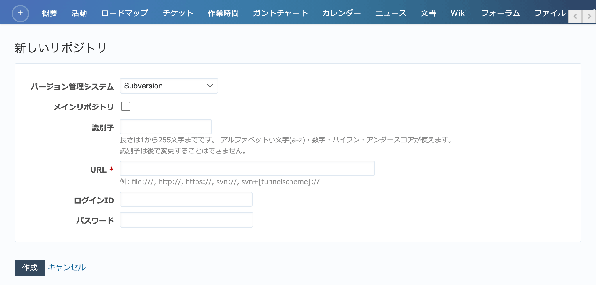
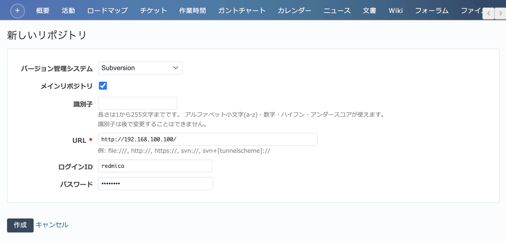
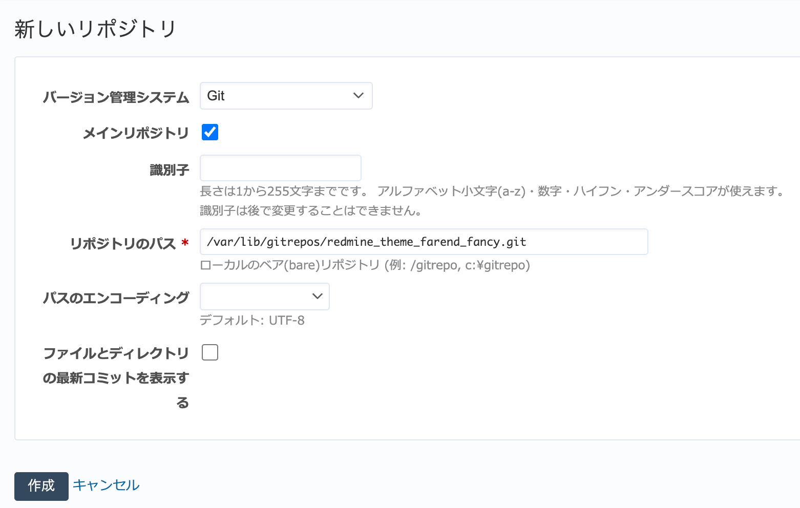
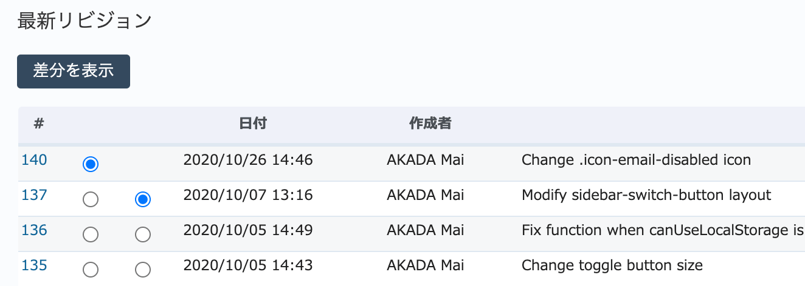
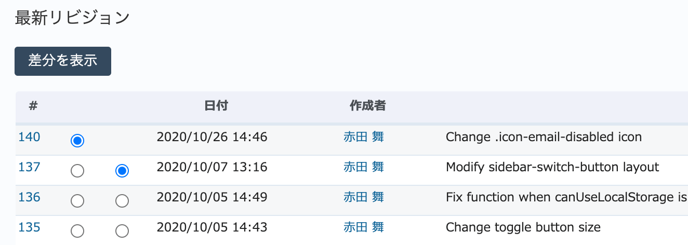
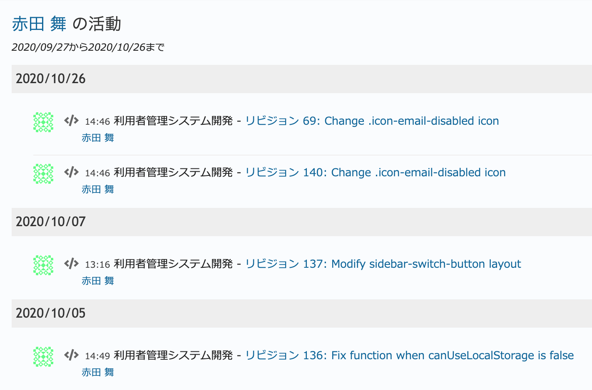

リポジトリ タブ（プロジェクトの設定）
-------------------------------------

SubversionやGitなどのバージョン管理システムにアクセスするための情報を設定するための画面です。リポジトリの設定を行うと、チケットとリポジトリ上のリビジョンの関連づけやリポジトリブラウザなど、バージョン管理システムとの連携機能が利用できるようになります。

    「設定」→「リポジトリ」→「新しいリポジトリ」

バージョン管理システムとの連携設定
**********************************

バージョン管理システムとの連携機能を利用するためには、RedMicaのプロジェクトからバージョン管理システムのリポジトリを参照させる設定を行います。

RedMicaはSubversion、Git、Mercurial、CVS、Bazaarの5種類のバージョン管理システムに対応しています。特に利用者が多いと思われるSubvertionおよびGitと連携するための設定を説明します。

Subversionとの連携設定
**********************

プロジェクトの :guilabel:`設定 --> リポジトリ` を開き、 :guilabel:`新しいリポジトリ` をクリックしてください。 :guilabel:`新しいリポジトリ` 画面が表示されます。

:guilabel:`新しいリポジトリ` 画面では、次の図と表を参考にSubversionリポジトリを参照するための情報を入力してください。

.. list-table::
   :header-rows: 1

   * - 名称
     - 説明

   * - バージョン管理システム
     - 使用するバージョン管理システムです。 :dfn:`Subversion` を選択してください。

   * - メインリポジトリ
     - 一つのプロジェクトで複数のリポジトリと連携している場合、このチェックボックスをONにしているリポジトリが最初に :guilabel:`リポジトリ` 画面に表示されます。また、チケットやWikiからリポジトリにリンクする際に識別子を省略するとメインリポジトリへのリンクとなります。

       一つのプロジェクトにつき一つのリポジトリだけをメインリポジトリとすることができます。デフォルトでは最初に設定したリポジトリがメインリポジトリとなります。

   * - 識別子
     - 一つのプロジェクトで複数のリポジトリと連携している場合、識別子の一覧が :guilabel:`リポジトリ` 画面の右サイドバーに表示されます。また、チケットやWikiからリポジトリを指定してリンクを行うとき、リポジトリを特定するために識別子を使用します。メインリポジトリ以外は識別子が必須です。

   * - URL
     - SubversionリポジトリにアクセスするためのURLです。ローカルのファイルシステム上のリポジトリ、ネットワーク越しにアクセスするリモートのリポジトリ、いずれも利用できます。

       なお、リポジトリのURLは一度登録すると変更できません。URLを変更したい場合は、リポジトリの設定を削除してから再度設定し直してください。

   * - ログインID
     - リポジトリにアクセスするためのユーザー名です。

   * - パスワード
     - リポジトリにアクセスするためのパスワードです。

.. note::
   * デフォルトではリポジトリのパスワードはデータベースに平文で保存されます。暗号化したい場合は :file:`config/configuration.yml` 内で :dfn:`database_cipher_key` を設定してください。

Gitとの連携設定
***************

RedMicaから参照できるGitリポジトリはRedMicaと同一サーバ上にあるbareリポジトリです。リモートのリポジトリやbareリポジトリではない通常のリポジトリには対応していません。

.. note::
   Gitのbareリポジトリとは、公開リポジトリ(:kbd:`git clone` や :kbd:`git push` されるリポジトリ)として使うためのリポジトリです。通常のリポジトリとは異なり作業ツリーが無いのでファイルの変更やコミットなどの操作は行えません。

RedMicaを実行しているサーバと同一のサーバで既にGitリポジトリを公開している場合、そのリポジトリはbareリポジトリなのでRedMicaから参照するよう設定できます。

別のサーバ上のGitリポジトリをRedMicaから参照するためには、RedMicaを実行しているサーバ上でそのリポジトリを :kbd:`--mirror` オプション付きでcloneしてbareリポジトリを作成します。以下はgithubで公開されているリポジトリをcloneしてbareリポジトリ :file:`/var/lib/gitrepos/redmine_theme_farend_fancy.git` を作成する例です。

Gitのbareリポジトリを作成する操作::

        mkdir /var/lib/gitrepos
        cd /var/lib/gitrepos
        git clone --mirror https://github.com/farend/redmine_theme_farend_fancy

bareリポジトリを作ったら、clone元の公開リポジトリにpushされた内容を自動的にbareリポジトリにも反映させるために、 :kbd:`git fetch` を定期的に実行するようにcrontabなどで設定してください。

bareリポジトリに元のリポジトリの更新を反映する操作::

        cd /var/lib/gitrepos/redmine_theme_farend_fancy.git && git fetch

bareリポジトリが準備できたら、RedMicaのプロジェクトからリポジトリを参照するための設定を行います。プロジェクトの :guilabel:`設定 --> リポジトリ` を開き、 :guilabel:`新しいリポジトリ` をクリックしてください。 :guilabel:`新しいリポジトリ` 画面が表示されます。

:guilabel:`新しいリポジトリ` 画面では、次の図と表を参考にGitリポジトリを参照するための情報を入力してください。

.. list-table::
   :header-rows: 1

   * - 名称
     - 説明

   * - バージョン管理システム
     - 使用するバージョン管理システムです。 :dfn:`Git` を選択してください。

   * - メインリポジトリ
     - 一つのプロジェクトで複数のリポジトリと連携している場合、このチェックボックスをONにしているリポジトリが最初に :guilabel:`リポジトリ` 画面に表示されます。また、チケットやWikiからリポジトリにリンクする際に識別子を省略するとメインリポジトリへのリンクとなります。

       一つのプロジェクトにつき一つのリポジトリだけをメインリポジトリとすることができます。デフォルトでは最初に設定したリポジトリがメインリポジトリとなります。

   * - 識別子
     - 一つのプロジェクトで複数のリポジトリと連携している場合、識別子の一覧が :guilabel:`リポジトリ` 画面の右サイドバーに表示されます。また、チケットやWikiからリポジトリを指定してリンクを行うとき、リポジトリを特定するために識別子を使用します。メインリポジトリ以外は識別子が必須です。

   * - リポジトリのパス
     - bareリポジトリのフルパスを入力してください。

       なお、リポジトリのパスは一度登録すると変更できません。パスを変更したい場合は、リポジトリの設定を削除してから再度設定し直してください。

   * - パスのエンコーディング
     - 通常はデフォルトまま :dfn:`UTF-8` とします。

   * - ファイルとディレクトリの最新コミットを表示する
     - OFFの場合、リポジトリブラウザの表示を高速に行うために :guilabel:`リポジトリ` 画面内のファイルの一覧で :guilabel:`リビジョン`, :guilabel:`年齢`, :guilabel:`作成者`, :guilabel:`コメント` の表示を省略します。デフォルトではOFFです。

連携設定の動作確認とトラブルシューティング
******************************************

連携設定に問題が無いかどうかは、設定後に :guilabel:`リポジトリ` 画面を開くことで確認できます。設定に問題なければリポジトリ内のディレクトリ・ファイルの一覧やリビジョンの一覧が表示されます。何らかの問題があるときは :dfn:`リポジトリに、エントリ/リビジョンが存在しません。` というエラーが表示されます。

エラーが表示されるときは次の点を確認してみてください。また、RedMicaの :file:`log/production.log` やwebサーバのエラーログも確認してみてください。バージョン管理システムのコマンドが出力したエラーメッセージが記録されていることがあります。

* リポジトリのURLが正しいか
* リポジトリにアクセスするためのユーザー名またはパスワードが正しいか
* RedMicaを実行しているOSのユーザーの環境で :kbd:`svn` や :kbd:`git` などのバージョン管理システムのコマンドが実行できているか
* ローカルのリポジトリを参照している場合、ファイルシステムのパーミッションに問題は無いか。RedMicaを実行するOSのユーザーがリポジトリにアクセスすることができるか

.. note::
   RedMicaの実行環境で :kbd:`svn` コマンドや :kbd:`git` コマンドにパスが通っておらずコマンドを実行できない場合、 :file:`config/configuration.yml` 内の設定項目 :dfn:`scm_subversion_command` や :dfn:`scm_git_command` にコマンドのフルパスを記述してください。

バージョン管理システムのユーザーとRedMicaのユーザーの関連づけ
*************************************************************

リポジトリブラウザでリポジトリの内容を参照するとき、 :guilabel:`作成者` 欄にはバージョン管理システム上でのユーザー名が表示され、Remdine上に登録されたユーザーとは関連づけられていません。

リポジトリの設定画面でユーザーの関連づけを行うと次のような効果があります。

* :guilabel:`リポジトリ` 画面の :guilabel:`作成者` 欄にRedMica上のユーザーの名前が表示される
* ユーザーの活動画面にリポジトリへのコミットも表示される

   ユーザーの関連づけが行われていない状態。作成者欄にバージョン管理システムのユーザーがそのまま表示される。

   ユーザーの関連づけが行われてた状態。作成者欄にRedMicaのユーザーの情報が表示されている。

   個人の活動画面にコミットの情報も表示されるようになる。

リポジトリのユーザーとRedMicaのユーザーの関連づけの設定は次の手順で行います。

#. プロジェクトの :menuselection:`設定 --> リポジトリ` を開く。

#. 設定したいリポジトリの右側の :guilabel:`ユーザー` をクリック。

   .. figure:: ../../images/settings-repository-user.png

#. リポジトリから検出されたユーザーの一覧が表示されるので関連づけたいRedMicaのユーザーを選択する。

   .. figure:: ../../images/repository-redmine-user-association.png

.. note::
   バージョン管理システム上のユーザー名とRedMicaのログインIDが同じ場合、この設定を行わなくても自動的に関連づけが行われます。
