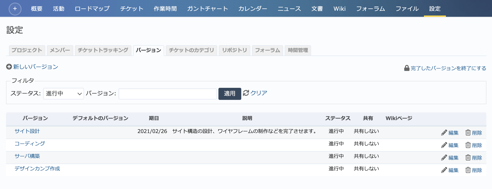
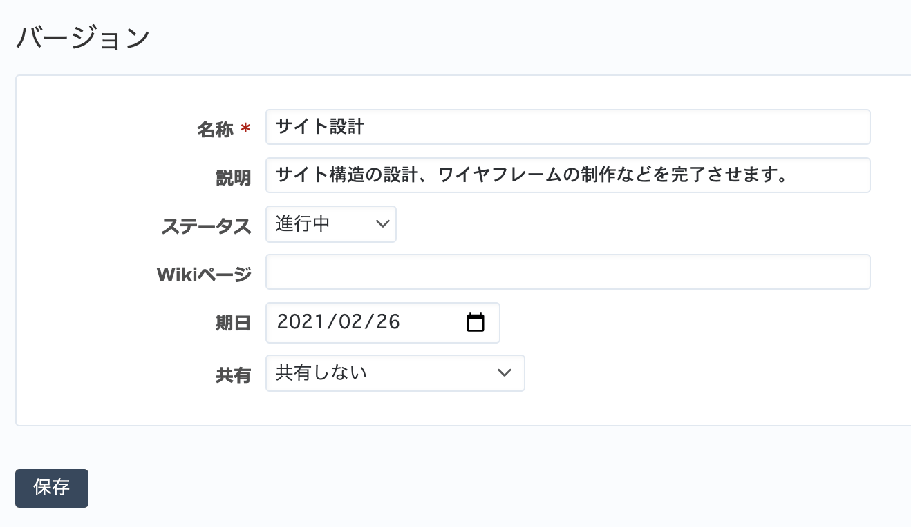
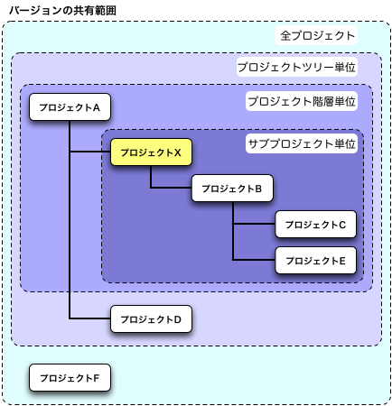

バージョン タブ（プロジェクトの設定）
-------------------------------------

:guilabel:`ロードマップ` 画面などで一覧表示されるバージョンの新規作成、編集、削除を行います。

    「設定」→「バージョン」タブ

バージョンの作成・編集
**********************

新たにバージョンを作成するには画面左上の「新しいバージョン」をクリックしてください。既存のバージョンを編集するには、編集したいバージョンの右側に表示されている「編集」をクリックしてください。バージョンの作成・編集を行うための画面が表示されます。

   バージョンの編集画面

.. list-table:: バージョンの作成・編集画面の入力項目
   :header-rows: 1

   * - 名称
     - 説明

   * - 名称
     - バージョンの名称です。 :guilabel:`ロードマップ` 画面などに表示されます。

   * - 説明
     - このバージョンに対する説明です。 :guilabel:`ロードマップ` 画面 などに表示されます。

   * - ステータス（編集画面のみ）
     - バージョンの状態を :dfn:`進行中`, :dfn:`ロック中`, :dfn:`終了` から選択します。

       * **進行中**: チケットを割り当てることができます。
       * **ロック中**: チケットを新たにバージョンに割り当てることができません。
       * **終了**: チケットを割り当てることができず、さらにロードマップ画面にも表示されなくなります。

   * - Wikiページ
     - バージョンについての説明を記述したWikiページの名称です。 :guilabel:`ロードマップ` 画面にここで指定したWikiページの内容も一緒に表示されます。 :guilabel:`説明` で書ききれない詳細情報を記載するのに使います。

   * - 期日
     - このバージョンがリリースされるべき期日です。関連づけられた全チケットはこの日までに完了すべきです。

   * - 共有
     - 親プロジェクトやサブプロジェクトでこのバージョンを共有するかどうか選択します。

       * **共有しない**: このプロジェクトだけでバージョンを使用します。
       * **サブプロジェクト単位**: このプロジェクトと子孫プロジェクトとの間で共有します。
       * **プロジェクト階層単位**: 「サブプロジェクト単位」の範囲に加えて、親プロジェクトなど上位階層のプロジェクトも共有範囲とします。
       * **プロジェクトツリー単位**: 最上位の親プロジェクトとそのすべての子孫プロジェクトを共有範囲とします。
       * **すべてのプロジェクト**: すべてのプロジェクトでバージョンを使用します。

   * - デフォルトのバージョン（作成画面のみ）
     - チケットを作成するときにデフォルトで選択したい場合はONに設定します。

    バージョンの共有範囲
