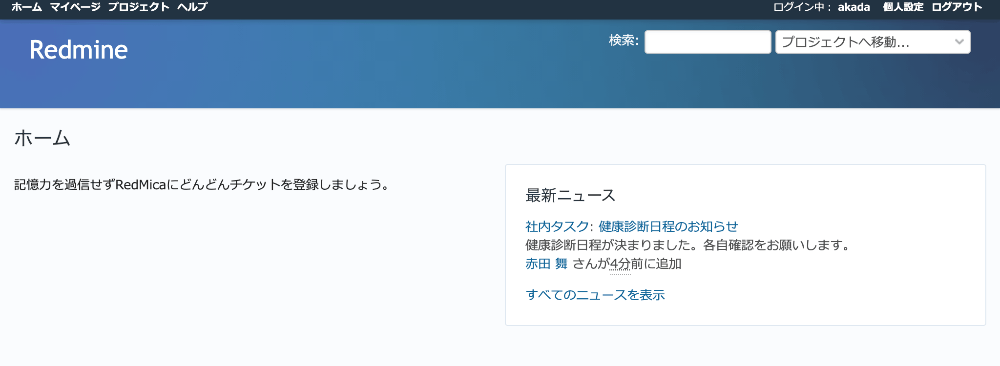

ホーム
------

ログイン直後に表示される画面です。

左側にウェルカムメッセージ、右側に最新ニュースが表示されます。

   「ホーム」画面

.. list-table:: ホームに表示される情報

   * - ウェルカムメッセージ
     - :menuselection:`管理 --> 設定 --> 全般` の :guilabel:`ウェルカムメッセージ` で入力した内容が表示されます。

       RedMicaの運用方針など利用者全員に周知したいことを表示するなどの使い方ができます。

   * - 最新ニュース
     - 参加している全プロジェクトの最新ニュースが表示されます。
