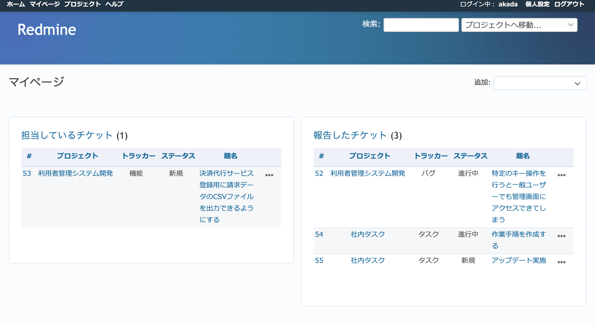

マイページ
----------

自分に関係する情報を表示させることができる画面で、表示内容はそれぞれのユーザーがカスタマイズできます。デフォルトでは :guilabel:`担当しているチケット`, :guilabel:`報告したチケット` が表示され、自分が抱えているタスクを確認したり、自分が作成したチケットが現在どのような状況なのか確認したりできます。

RedMicaにログインしたらこの画面で自分の手持ち作業の一覧、自分が作成したチケットの進捗状況などを確認するよう習慣づけるとよいでしょう。

画面右上の :guilabel:`追加` のドロップダウンリストをクリックすると、:dfn:`マイページパーツ` と呼ばれる情報が表示するための部品の追加や配置変更が可能で、表示内容を使いやすいよう変更できます。RedMicaに標準で組み込まれているマイページパーツを以下に示します。

.. list-table:: マイページパーツの一覧

   * - 担当しているチケット
     - 自分が担当している未完了のチケットのうち、直近で更新されたもの10件を表示します。

   * - 報告したチケット
     - 自分が作成したチケットのうち、直近で更新された10件を表示します。

   * - 更新したチケット
     - 自分が更新したチケットのうち、直近で更新されたもの10件を表示します。

   * - ウォッチしているチケット
     - 自分がウォッチしているチケットのうち、直近で更新されたもの10件を表示します。

   * - チケット
     - 選択したカスタムクエリによって抽出したチケットを10件表示します。

   * - 最新ニュース
     - 自分が所属しているプロジェクトの最新ニュース10件を表示します。

   * - カレンダー
     - 1週間分のカレンダーに、自分が所属しているすべてのプロジェクトの全チケットの開始日・期日が表示されます。チケット番号をクリックすると詳細画面に遷移できます。

   * - 文書
     - 自分が所属しているプロジェクトの最新10件の文書を表示します。

   * - 作業時間
     - 過去7日間にチケットに記録した作業工数を表示します。

   * - 活動
     - 自分がRedMicaのプロジェクトに対して行った最新10件分の更新を時系列で表示します。

  「マイページ」画面

.. note::
   マイページパーツを追加するプラグインをインストールすれば、標準で組み込まれているもの以外のものも利用できます。
