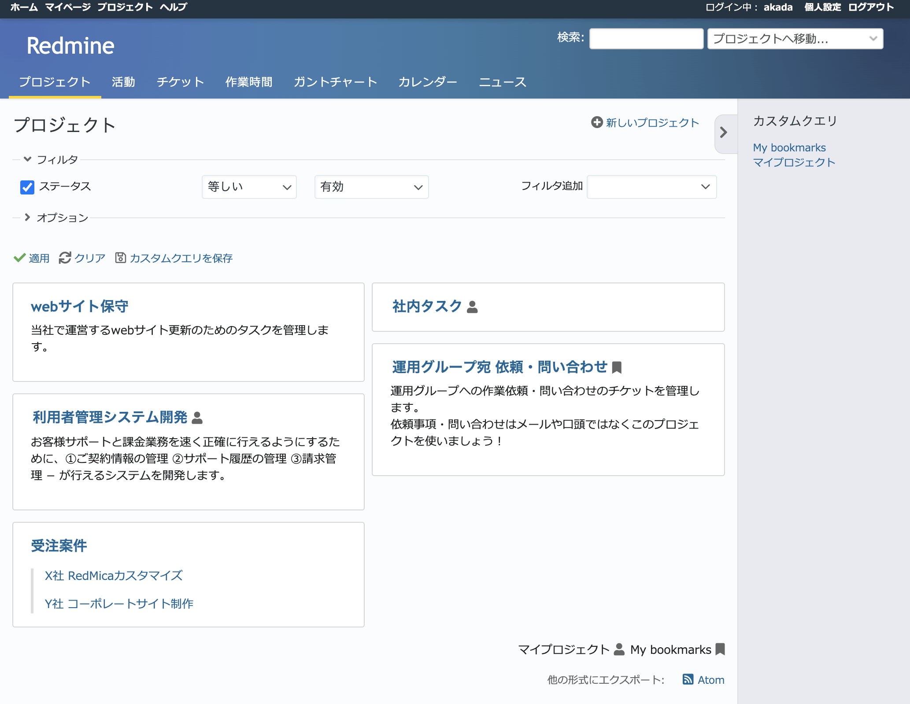
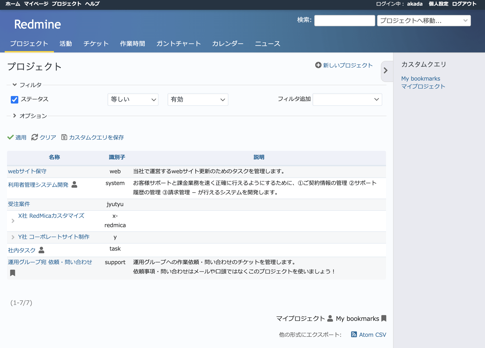

プロジェクト
------------

自分がアクセス可能なプロジェクトが一覧表示されます。

ボードまたはリストの表示形式から選択できます。表示形式のデフォルトは :menuselection:`管理 --> 設定 --> プロジェクト` の :guilabel:`プロジェクトの一覧で表示する項目` で設定できます。

自分がメンバーとなっているプロジェクトやブックマークしたプロジェクトにはアイコンが表示されます。マイプロジェクトのアイコンが表示されていないものは公開プロジェクトなどメンバーではないもののアクセス可能なプロジェクトです。

   「プロジェクト」画面（ボード）

  「プロジェクト」画面（リスト）
