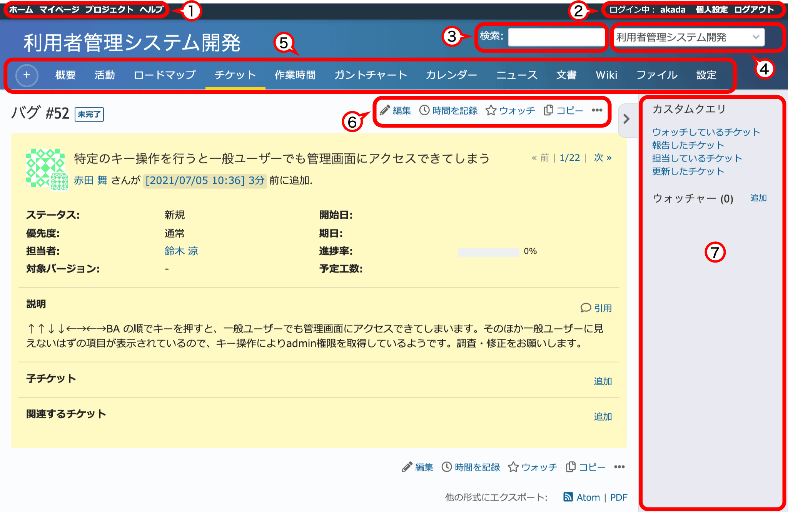

RedMicaの画面各部の名称
=======================

RedMicaの画面内のメニュー等の名称は以下の通りです。

   RedMicaの画面各部の名称

.. list-table:: RedMicaの画面各部の名称
  :header-rows: 1

  * - 番号と名称
    - 説明

  * - ①トップメニュー
    - 個別のプロジェクトや表示中の画面に依存しない、RedMica全体に関係するメニューです。

  * - ②アカウントメニュー
    - 現在ログイン中のアカウントの設定変更やパスワード変更を行う「個人設定」や「ログアウト」など、現在ログイン中のユーザに関係する項目が表示されるメニューです。

  * - ③クイックサーチ
    - チケットやWikiページなどRedMica上の情報を検索するための検索ボックスです。

  * - ④プロジェクトセレクタ
    - プロジェクトの選択を行います。

  * - ⑤プロジェクトメニュー
    - プロジェクトセレクタで選択したプロジェクトに関係するメニューです。

  * - ⑥コンテキストリンク
    - 現在表示中の画面に関連した操作が表示されます。

  * - ⑦サイドバー
    - 現在表示中の画面に関連した操作・情報が表示されます。
